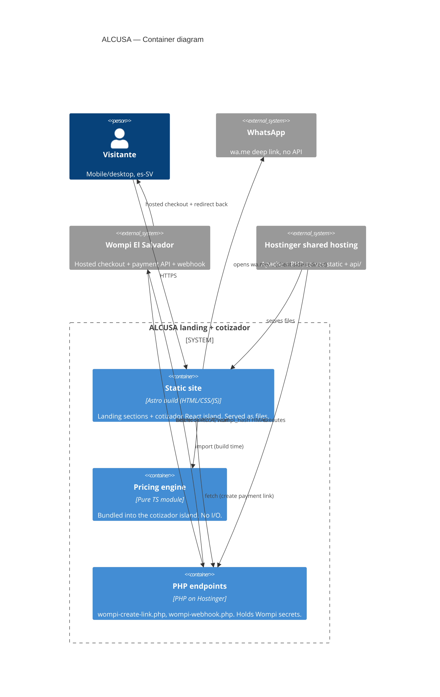
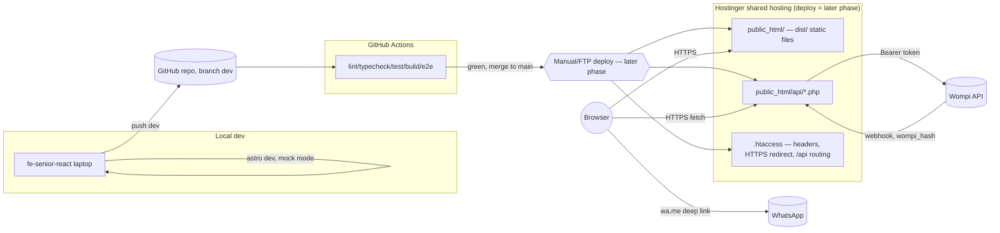

# ALCUSA — Landing + Cotizador — Architecture

Client: Aluminios Cuzcatlán, S.A. de C.V. (brand ALCUSA), El Salvador.
Status: design approved, implementation starting. This document is the contract
`fe-senior-react` builds against. Related: `docs/product/` (po-pm's pitch/backlog/
slices, written in parallel), `02-design/` (tokens, boards, motion language).

## 1. Context (current state, honestly)

There is no current production app. Today ALCUSA runs two unrelated live sites
(Wix `alcusasv.com` + a `chatgpt.site` store with four separate quoters and a
cart) which this project replaces with **one** landing + unified cotizador. The
`03-dev` repo (`git@github.com:cmaganacdcsolutions/alcusa-sv-landing-cotizador.git`)
is currently empty (README + .gitignore only, branch `dev`). Nothing here
describes a system that exists yet — it describes the one we are about to build.

## 2. Drivers and NFRs

| Driver | Value | Source |
|---|---|---|
| Traffic | **ASSUMPTION**: 50–200 sessions/day at launch, <5 concurrent. Revisit hosting/CDN if sustained >2,000 sessions/day. | no analytics handed off; guess labeled |
| Team | 1 implementing frontend senior (fe-senior-react) + this architecture; no dedicated backend/infra hire | task brief |
| Hosting | Alcusa's existing Hostinger account, **plan unknown** → assume shared hosting: Apache + PHP, `.htaccess`, SSH not guaranteed | hard constraint |
| Budget | No new infra spend; reuse what's paid for | inferred |
| Compliance | PII (name, phone, address) passes through WhatsApp (Meta) or Wompi's hosted checkout only; **no card data ever touches ALCUSA's server or code** (PCI SAQ-A posture) | design constraint |
| Availability | No SLA beyond Hostinger's own; static files ⇒ trivial to redeploy | derived |
| RPO/RTO | RPO ≈ 0 (git is the source of truth, no DB to lose); RTO ≈ minutes (redeploy static build + PHP files) | derived — there is **no order database**, see ADR-002/006 limitation |
| LCP (mobile, throttled 4G, Lighthouse) | ≤ 2.5s (stretch 2.0s) | NFR |
| CLS | ≤ 0.1 | NFR |
| INP | ≤ 200ms | NFR |
| JS budget | Static landing (everything above/around the cotizador): ≤ 40KB gzipped JS on first paint. Cotizador island, loaded on demand: ≤ 90KB gzipped. Worst case (user reaches cotizador): ≤ 150KB gzipped total. | NFR, drives ADR-001 |
| Images | AVIF/WebP with `<picture>` fallback, 3 responsive widths (400/800/1200), hero `fetchpriority="high"` + `<link rel=preload>`, everything else lazy. Hero ≤ 200KB. | NFR |
| Accessibility | WCAG 2.2 AA: contrast, focus-visible, keyboard-operable drawer/stepper, `aria-live=polite` on price updates, labelled inputs, errors never color-only (spec already requires this) | NFR |
| Motion | `prefers-reduced-motion: reduce` disables the Light Sweep Reveal and all non-essential transitions; state changes become instant | `motion-language.md` |
| SEO | One canonical URL, es-SV meta, OG/Twitter card, `LocalBusiness` JSON-LD (name, address, phone; hours/years pending client answers — ship with placeholders flagged), `sitemap.xml`, `robots.txt` | NFR |
| Security headers | CSP, `X-Content-Type-Options: nosniff`, `Referrer-Policy: strict-origin-when-cross-origin`, `Permissions-Policy` minimal, HSTS (once TLS on Hostinger confirmed) — all via `.htaccess` | NFR |
| Viewports tested | iOS Safari 390×844 (WebKit), Android Chrome 412×915 (Chromium), Desktop 1920×1080 | task brief |

## 3. Stack (see ADR-001 for full reasoning)

**Astro (static output) + React islands, TypeScript, Vite under the hood.**
The landing (hero, catálogo, galería, confianza, info, contacto, footer) ships as
plain static HTML/CSS with ~zero JS. The **only** interactive subtree — the
cotizador wizard and the contact form — hydrates as a React island
(`client:visible`), because that is the one place with real state, live pricing
and a multi-step flow that benefits from React + a typed reducer. This keeps the
JS budget honest without inventing a second framework's worth of ceremony: the
team writes React exactly where React earns its cost.

## 4. Repo structure (exact tree fe-senior-react creates)

```
03-dev/
├── .github/workflows/ci.yml
├── .env.example
├── package.json
├── astro.config.mjs
├── tsconfig.json
├── vitest.config.ts
├── playwright.config.ts
├── .htaccess                     # security headers + static/api routing (deploy artifact, also kept in repo)
├── public/
│   ├── favicon.svg
│   ├── robots.txt
│   └── images/                   # optimized avif/webp, derived from 01-discovery/assets
├── src/
│   ├── layouts/BaseLayout.astro  # <head>, meta, JSON-LD, tokens.css import
│   ├── components/                # STATIC, .astro, no business logic
│   │   ├── TopBar.astro
│   │   ├── Drawer.astro
│   │   ├── Hero.astro
│   │   ├── ComoFunciona.astro
│   │   ├── Catalogo.astro
│   │   ├── Galeria.astro
│   │   ├── Confianza.astro
│   │   ├── InfoImportante.astro
│   │   ├── Contacto.astro
│   │   └── Footer.astro
│   ├── islands/                   # React, hydrated client-side only
│   │   ├── Cotizador/
│   │   │   ├── Cotizador.tsx              # root island, client:visible on #cotizador
│   │   │   ├── steps/
│   │   │   │   ├── Step0Producto.tsx
│   │   │   │   ├── Step1Medidas.tsx
│   │   │   │   ├── Step2Precio.tsx
│   │   │   │   ├── Step3ZonaEntrega.tsx
│   │   │   │   ├── Step4Resumen.tsx
│   │   │   │   ├── Step5FormaPago.tsx
│   │   │   │   ├── Step6Wompi.tsx
│   │   │   │   └── Step7Resultado.tsx
│   │   │   └── state/cotizadorStore.ts    # reducer + hash/history sync, ADR-005
│   │   └── ContactForm.tsx
│   ├── engine/                     # PURE TypeScript, zero DOM/React imports, unit-tested
│   │   ├── pricing/
│   │   │   ├── straight.ts  corner.ts  tempered.ts
│   │   │   ├── hinged.ts  windows.ts  garden.ts
│   │   │   ├── zoneFee.ts            # 23-municipio transport table
│   │   │   ├── types.ts
│   │   │   └── index.ts
│   │   └── pricing/*.test.ts
│   ├── integrations/                # side-effecting boundary, isolated from engine/
│   │   ├── whatsapp/
│   │   │   ├── buildMessage.ts       # templates §2.6 (cotizador) + §2.9 (contact)
│   │   │   ├── buildMessage.test.ts
│   │   │   └── waLink.ts
│   │   └── wompi/
│   │       ├── client.ts             # calls OUR php endpoint only, never Wompi directly
│   │       ├── mock.ts                # local/dev/test mock, default in dev
│   │       └── types.ts
│   ├── content/
│   │   ├── catalog.ts                # 6 products, teaser prices
│   │   └── pricingTables.ts          # data from exploratory-report.md §3 / source-inventory.md §6
│   ├── styles/
│   │   ├── tokens.css                # copied from 02-design/brand/tokens.css, not re-authored
│   │   └── global.css
│   ├── pages/index.astro             # the ONE page; assembles components + islands
│   └── env.d.ts
├── api/                              # PHP, deployed to Hostinger alongside the static build
│   ├── wompi-create-link.php         # holds WOMPI secrets server-side only
│   ├── wompi-webhook.php             # verifies wompi_hash HMAC, see ADR-003
│   └── _lib/wompi-config.php         # reads env, never returns secrets to client
├── tests/
│   └── e2e/
│       ├── cotizador.spec.ts
│       ├── whatsapp-links.spec.ts
│       ├── wompi-mock-flow.spec.ts
│       └── a11y.spec.ts              # @axe-core/playwright
└── docs/
    ├── product/                      # po-pm
    └── architecture/                 # this deliverable
```

**Module boundary rule (enforced at review, see gate checklist):**
`engine/` never imports React, Astro, `window`, `document` or `fetch` — it is
pure functions in, values out, so pricing can be unit-tested without a DOM and
never drifts silently. `integrations/` is the only place allowed to touch
`window.location`, `fetch`, or build a `wa.me` URL. `islands/` orchestrate UI
state and call `engine/` + `integrations/` — they contain no pricing math and no
raw WhatsApp/Wompi URLs. `components/*.astro` are static and contentful only.

## 5. Env vars (`.env.example` — commit this file, never the real values)

```
# Public — safe to ship in the client bundle
PUBLIC_SITE_URL=https://alcusasv.com
PUBLIC_WHATSAPP_NUMBER=50376802410
PUBLIC_GOOGLE_MAPS_LINK=
PUBLIC_COTIZADOR_MODE=mock          # mock | live — forced to "mock" in dev and in CI/e2e

# Server-only — read by api/*.php, NEVER exposed to the client bundle
WOMPI_ENV=sandbox                   # sandbox | production
WOMPI_API_BASE_URL=                 # confirm exact host with client/Wompi docs before go-live
WOMPI_CLIENT_ID=
WOMPI_CLIENT_SECRET=
WOMPI_WEBHOOK_SECRET=               # API Secret used to verify the wompi_hash HMAC
```

## 6. Scripts

| Script | Purpose |
|---|---|
| `dev` | `astro dev` — local server, `PUBLIC_COTIZADOR_MODE=mock` by default |
| `lint` | ESLint (ts + astro plugin) |
| `typecheck` | `astro check && tsc --noEmit` |
| `test` | `vitest run --coverage` (engine/ + integrations/) |
| `test:e2e` | `playwright test` — 3 projects, mock mode forced, real WhatsApp/Wompi network blocked |
| `build` | `astro build` → static `dist/` |
| `preview` | `astro preview` — serves `dist/` for e2e against a prod-like build |

## 7. CI pipeline (`.github/workflows/ci.yml`) and quality gates

Trigger: push/PR on any branch; required to pass before `dev → main` merge
(branch protection on `main`).

1. install → 2. `lint` → 3. `typecheck` → 4. `test` (coverage gate: `engine/` ≥
90%) → 5. `build` → 6. `test:e2e` (against `preview`, 3 Playwright projects +
axe) → 7. secret-scan (grep for key-shaped strings / `gitleaks`) → 8. bundle-size
report (fails if cotizador island > 90KB gz or landing JS > 40KB gz).
Merge `dev → main` only when every step is green.

## 8. Diagrams

### 8.1 C4 — Container



### 8.2 Deployment



### 8.3 Sequence — Cotizador → WhatsApp (no backend)

```mermaid
sequenceDiagram
  actor U as Usuario
  participant W as Wizard (React island)
  participant E as engine/pricing
  participant I as integrations/whatsapp
  U->>W: completa pasos 0-4 (producto, medidas, zona, resumen)
  W->>E: calcular(subtotal, transporte, total)
  E-->>W: precios (puro, sin I/O)
  U->>W: "Enviar por WhatsApp para confirmar"
  W->>I: buildMessage(cartState)
  I-->>W: texto plantilla §2.6, URL-encoded
  W->>U: abre wa.me/50376802410?text=... (nueva pestaña/app)
  Note over W,U: sin llamada a servidor; nada se persiste
```

### 8.4 Sequence — Cotizador → Wompi → retorno/webhook

```mermaid
sequenceDiagram
  actor U as Usuario
  participant W as Wizard (React island)
  participant P as api/wompi-create-link.php
  participant WO as Wompi API
  U->>W: elige "Pagar ahora" (80% o 100%) y confirma
  W->>P: POST /api/wompi-create-link.php {monto, referencia}
  P->>WO: POST enlace-de-pago (Bearer token, secretos server-side)
  WO-->>P: {id, url_checkout}
  P-->>W: {url_checkout}
  W->>U: redirige a url_checkout (Wompi hosted, PCI fuera de nuestro server)
  U->>WO: completa pago en Wompi
  WO-->>U: redirige a return_url (#cotizador/7?status=...)
  par en paralelo
    WO->>P: POST /api/wompi-webhook.php {payload, header wompi_hash}
    P->>P: HMAC-SHA256(body, WOMPI_WEBHOOK_SECRET) == wompi_hash ?
    P-->>WO: 200 OK (o 400 si la firma no coincide)
  end
  W->>U: pantalla Resultado (éxito/declinado) leída de query params del return_url
  Note over P: sin BD — el webhook solo verifica/loguea; la fuente de verdad de la\norden es el hilo de WhatsApp + el dashboard de Wompi (ver ADR-003, tech-debt).
```

## 9. Known limitations / tech debt (see `docs/architecture/tech-debt.md`)

No order database exists in this architecture — the return screen renders from
Wompi's redirect query params, the webhook only verifies+logs. This is
appropriate for current volume; revisit when order reconciliation or refund
handling needs a persistent store.

## 10. Slice-by-slice build order (handed to po-pm)

1. **Slice 0 — scaffold**: repo tree above, tokens.css wired, CI green on an
   empty page (this unblocks everything else).
2. **Slice 1 — static landing**: TopBar/Drawer, Hero, ComoFunciona, Catálogo,
   Galería, Confianza, InfoImportante, Footer, Contacto shell (no form logic
   yet). SEO/JSON-LD, security headers, a11y pass on static content.
3. **Slice 2 — pricing engine**: `engine/pricing/*` + tests, built from
   `exploratory-report.md` §3 and `source-inventory.md` §6, **before** any UI
   wires to it.
4. **Slice 3 — cotizador steps 0-4** (producto → medidas → precio → zona →
   resumen), wired to the engine, hash/back-button per ADR-005.
5. **Slice 4 — WhatsApp integration** (`integrations/whatsapp`) + contact
   webform, step 5's WhatsApp branch, step 7 fallback CTA.
6. **Slice 5 — Wompi integration**: PHP endpoints + mock mode + step 6/7 UI.
   Blocked on client providing sandbox credentials (see HANDOFF).
7. **Slice 6 — hardening**: Playwright 3-viewport + axe suite, Lighthouse
   budget check, `.htaccess` headers, final CI gate before `main`.

Schema-before-contract-before-UI applies: pricing tables and message templates
(data) must exist and be tested before any step UI consumes them.
