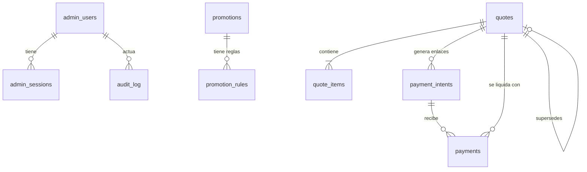

# ADR-010: Base de datos y modelo de datos (CR-01: panel admin, promociones, cotizaciones, ventas, contactos)

Date: 2026-09-29
Status: proposed (pendiente de revisión del cliente; se vuelve accepted al aprobar CR-01)

## Contexto
Hasta hoy el sistema no tiene base de datos. README §2 declara "RPO ≈ 0 (git es la fuente de verdad, no hay BD)";
ADR-003 guarda órdenes Wompi como archivos planos en `alcusa-private/data/{orders,processed}`; ADR-008 mantiene las
promociones en `src/content/promotions.ts` (build-time); ADR-009 genera el número de cotización en el navegador
(`ALC-AAAAMMDD-XXXX`) y aclara que "es una referencia, no un registro".

El cambio CR-01 cambia esa premisa: promociones editables por el cliente, cotizaciones con ID único visible para
cliente y admin, ventas Wompi ligadas a su cotización, contactos y un panel admin que lo lista todo. Por primera vez
el sistema **guarda datos personales y de dinero** y el RPO deja de ser 0: hay que diseñar respaldo, retención y
migraciones como parte de la arquitectura, no después.

Restricciones vigentes: VPS Hostinger KVM 2 (2 vCPU, 8 GB, 100 GB NVMe), Ubuntu 24.04 sin panel, Nginx + PHP-FPM 8.3
en pool dedicado `alcusa` con `open_basedir` y `disable_functions` (ADR-002 rev. 2026-09-29, runbook
`05-ops/runbook-migracion-deploy.md`); despliegue rsync a `releases/<ts>` + symlink; equipo sin DBA dedicado.
El SO del VPS aún no está aprovisionado, así que la elección no tiene costo de migración.

### Drivers y NFR (SUPUESTOS marcados, ninguno dado por el cliente)
| Driver | Valor |
|---|---|
| Volumen | SUPUESTO: 5–30 cotizaciones/día, 0–5 pagos/día, 0–10 contactos/día, <30 promociones/año. Crecimiento 10x sigue cabiendo en cualquier motor considerado. |
| Datos | SUPUESTO: <200 MB/año sin imágenes (las imágenes viven en disco, no en BD) |
| Concurrencia de escritura | <1 escritura/s sostenida; ráfagas del webhook de Wompi |
| Disponibilidad | Sin SLA propio; una sola VPS. Si la BD cae, **landing, catálogo y promociones publicadas siguen sirviéndose** (ver ADR-011) |
| RPO / RTO | RPO ≤ 24 h (dump nocturno; ver §6), RTO ≤ 2 h (reprovisionar + restore). Subir a RPO ≤ 15 min con binlog solo si ventas/día lo justifican |
| PII | nombre, teléfono, email opcional, zona/dirección de entrega, texto libre de contactos. Nunca datos de tarjeta (SAQ-A intacto, ADR-003) |
| Equipo | 1 dev frontend + seniors de agente; nadie de guardia 24/7. La operación debe ser aburrida |
| Presupuesto | Sin gasto nuevo recurrente en la BD (mismo VPS) |

## Decisión

### 1. Motor: MariaDB 10.11 LTS (paquete de Ubuntu 24.04), local en el mismo VPS
Solo socket Unix / `127.0.0.1`, **nunca** expuesto a Internet (ufw + `bind-address=127.0.0.1`, `skip-networking` si
el socket basta). InnoDB, `utf8mb4` / `utf8mb4_unicode_ci`, zona horaria de sesión UTC, `sql_mode=STRICT_ALL_TABLES,...`.

| Criterio | MariaDB/MySQL | SQLite | PostgreSQL |
|---|---|---|---|
| Encaje operativo en este VPS | `apt install`, un servicio, PDO ya en PHP (`pdo_mysql`) | Cero servicios; un archivo | `apt install`, un servicio, `pdo_pgsql` |
| Escritores concurrentes desde PHP-FPM (webhook + admin + formularios) | Correcto (bloqueo por fila) | Un escritor a la vez (WAL lo mitiga); `SQLITE_BUSY` bajo ráfagas es un modo de falla nuevo | Correcto |
| Mínimo privilegio | Usuarios y GRANT por tabla (p. ej. `audit_log` solo INSERT/SELECT) | Ninguno: quien abre el archivo puede todo | Igual que MariaDB |
| Respaldo en caliente consistente | `mariadb-dump --single-transaction`, binlog opcional | `.backup`/`VACUUM INTO` (válido) | `pg_dump` |
| JSON, constraints, FKs | `JSON` (alias de LONGTEXT + `CHECK JSON_VALID`), FKs, `CHECK` | JSON1, FKs opt-in, tipado laxo | `jsonb`, mejor tipado (el más fuerte) |
| Familiaridad / documentación Hostinger | La documentación y tooling de Hostinger asume MySQL/MariaDB | Alta | Media |
| Costo de salida | Dump SQL estándar; Postgres es un salto razonable | Trivial hacia cualquiera | Trivial hacia cualquiera |

Elección: **MariaDB**. Motivos decisivos: usuarios con mínimo privilegio y tabla de auditoría append-only,
concurrencia de escritura sin caso especial, respaldo en caliente estándar y ecosistema alineado con el hosting.
Honestidad: PostgreSQL sería igual de válido y técnicamente más estricto; MariaDB gana por familiaridad operativa y
porque el esquema es simple. SQLite se descarta no por rendimiento (aguantaría) sino por la ausencia de privilegios
por tabla y de escritura concurrente segura entre el webhook (dinero) y el admin.
Costo: `JSON` de MariaDB es texto validado (sin índices funcionales cómodos); por eso los campos consultables son
columnas reales y JSON solo guarda parámetros. Salida: `mariadb-dump` → migrar a Postgres reescribiendo tipos
(los SQL de migración se escriben sin extensiones de MariaDB a propósito: `DECIMAL`, `DATETIME`, `VARCHAR`, `ENUM` → `VARCHAR + CHECK`).
Rechazado también: un servicio de BD gestionado (costo recurrente + latencia + datos personales fuera del VPS sin driver que lo pida).

### 2. Convenciones
- PK `BIGINT UNSIGNED AUTO_INCREMENT` interna; **nunca se expone** como identificador público (ver §4).
- Dinero: `DECIMAL(10,2)` en USD; jamás `FLOAT`. Cantidades `INT UNSIGNED`.
- Fechas: `DATETIME` en **UTC** (`created_at`, `updated_at`); fechas de negocio de vigencia (`starts_on`, `ends_on`) son `DATE`
  interpretadas como fecha de El Salvador (UTC−6 sin DST), igual que ADR-008 (comparación de strings `YYYY-MM-DD`).
- Estados como `VARCHAR(20)` + `CHECK (status IN (...))` (no `ENUM`, para migrar sin `ALTER` costoso y salir a Postgres).
- Todas las consultas con PDO preparado (`ATTR_EMULATE_PREPARES=false`, `ERRMODE_EXCEPTION`).
- Sin borrado físico de negocio salvo la purga de retención (§7): promociones se `archive`, cotizaciones/pagos nunca se borran a mano.

### 3. Esquema (v1, migración `0001_init.sql`)

Resumen por tabla (tipos completos los fija `senior-dba` en la migración; lo listado es contrato mínimo).

**`promotions`**
`id`, `title` VARCHAR(120), `description` TEXT (texto plano, sin HTML), `price_before` DECIMAL NULL, `price_promo` DECIMAL,
`image_key` VARCHAR(64) NULL (clave de imagen, no ruta; ver ADR-011), `image_alt` VARCHAR(160),
`product_slug` VARCHAR(80) NULL (slug de ADR-008 para el CTA `/cotizador?producto=`), `starts_on` DATE, `ends_on` DATE,
`status` (`draft|published|archived`), `sort_order` INT, `created_by`/`updated_by` FK `admin_users`, timestamps.
Índice `(status, starts_on, ends_on, sort_order)`. Regla equivalente a ADR-008: activa = `published` y
`starts_on <= hoy_SV <= ends_on`; `price_promo < price_before` cuando ambos existen. El precio promo es explícito, nunca calculado.

**`promotion_rules` (extensible)** — las reglas aún no están definidas por el cliente.
`id`, `promotion_id` FK (ON DELETE CASCADE), `rule_type` VARCHAR(40), `params` JSON con `CHECK (JSON_VALID(params))`,
`position` INT, `enabled` TINYINT, `schema_version` SMALLINT, timestamps.
Diseño: **el motor de BD no conoce los tipos de regla; el código sí.** Un registro `PromotionRuleRegistry` en PHP mapea
`rule_type` → validador de `params` + renderizador para admin y para el JSON público. Agregar un tipo de regla =
una clase PHP + tests, **sin migración**. Tipo entregado en v1: `terms` (`{"text":"..."}`, condiciones en texto libre,
solo informativas). Tipos reservados, NO implementados hasta que el cliente los defina: `min_quantity`, `zone_only`,
`applies_to_product`, `min_amount`, `coupon_code`. Regla firme: mientras una regla no tenga un implementador en el
motor de precios, es **informativa** (se muestra, no altera totales). Si el cliente pide reglas que cambian el precio
del cotizador, eso necesita un ADR propio: el motor de precios es TypeScript en el cliente (ADR-008/009) y hoy no hay
motor equivalente en el servidor (ver tech-debt propuesto en ADR-011).
Descartado: tabla EAV por atributo (consultas ilegibles, sin validación), columnas por regla (migración por cada idea del cliente), JSON único en `promotions` (no permite ordenar/activar reglas por separado ni auditarlas por fila).

**`quotes`**
`id`, `code` CHAR(17) UNIQUE (folio público, ver §4), `idempotency_key` CHAR(36) UNIQUE, `status`
(`issued|awaiting_payment|partially_paid|paid|expired|cancelled|superseded`), `supersedes_quote_id` FK NULL,
`customer_name` VARCHAR(120), `customer_phone` VARCHAR(20) (E.164), `customer_email` VARCHAR(160) NULL,
`delivery_mode` (`pickup|delivery`), `delivery_zone` VARCHAR(60) NULL, `delivery_address` VARCHAR(255) NULL,
`subtotal` / `transport_fee` / `total` DECIMAL, `currency` CHAR(3) DEFAULT 'USD', `valid_until` DATE,
`pricing_source` VARCHAR(20) (`client` hoy; ver ADR-011 sobre confianza del precio), `client_cart_hash` CHAR(64),
`source` VARCHAR(20) (`cotizador`), `ip_hash` CHAR(64) NULL, `created_at`, `updated_at`, `anonymized_at` NULL.
Índices: `(status, created_at)`, `(customer_phone)`, `(created_at)`.

**`quote_items`** — foto inmutable de lo que el cliente vio.
`id`, `quote_id` FK (CASCADE), `position`, `product_slug`, `description` VARCHAR(255), `qty`, `unit_price`, `line_total`,
`config` JSON (medidas, vidrio, acabado: lo que produzca el cotizador; no se consulta por sus claves).

**`payment_intents`** — reemplaza los archivos `data/orders/*.json` de ADR-003.
`id`, `quote_id` FK, `reference` VARCHAR(40) UNIQUE (el `identificadorEnlaceComercio` enviado a Wompi = `<code>-P<n>`),
`percent` TINYINT (p. ej. 80/100), `amount` DECIMAL (calculado en servidor desde `quotes.total`), `wompi_link_id`, `wompi_link_url`,
`status` (`created|link_failed|paid|failed|expired`), timestamps.

**`payments`** — un evento de transacción Wompi = una fila.
`id`, `wompi_transaction_id` VARCHAR(64) UNIQUE (idempotencia del webhook), `payment_intent_id` FK NULL, `quote_id` FK NULL,
`reference` VARCHAR(64) (tal como llegó), `amount` DECIMAL, `result` VARCHAR(40) (`ResultadoTransaccion`),
`status` (`approved|failed|amount_mismatch|test|unmatched`), `is_productive` TINYINT (`EsProductiva`),
`raw_event` JSON (payload del webhook ya verificado, sin cabeceras), `received_at`.
`quote_id`/`payment_intent_id` NULL = pago no conciliado: se guarda igual y el admin lo ve marcado.
Un pago `test` (EsProductiva=false) nunca cuenta para `paid`.

**`contacts`**
`id`, `name` VARCHAR(120), `phone` VARCHAR(20) NULL, `email` VARCHAR(160) NULL (al menos uno requerido), `message` TEXT (máx. 2000),
`status` (`new|read|answered|spam`), `source` VARCHAR(30), `consent_at` DATETIME (aceptó aviso de privacidad),
`ip_hash` CHAR(64) NULL, `dedupe_hash` CHAR(64), `created_at`, `handled_by` FK NULL, `anonymized_at` NULL.

**`admin_users`**
`id`, `username` VARCHAR(40) UNIQUE, `password_hash` VARCHAR(255) (argon2id), `must_change_password` TINYINT,
`totp_secret_enc` VARBINARY(96) NULL (cifrado con libsodium, clave fuera de la BD), `totp_enabled_at` NULL, `totp_last_step` BIGINT NULL,
`recovery_codes_hash` JSON NULL, `failed_attempts` SMALLINT, `locked_until` DATETIME NULL, `last_login_at`, `is_active`, timestamps.
Sin columna de email ni "olvidé mi contraseña": la recuperación es por SSH (ADR-011). Sin rol en v1 (todos los admins pueden todo; ver tech-debt).

**`admin_sessions`**
`id_hash` CHAR(64) PK (SHA-256 del identificador aleatorio; el valor en claro solo vive en la cookie), `admin_id` FK, `csrf_token`
CHAR(64), `created_at`, `last_seen_at`, `expires_at`, `ip_hash`, `user_agent_hash`, `stage` (`password_ok|active`).
Una BD robada no entrega sesiones válidas.

**`rate_limits`**
`bucket` VARCHAR(80) + `window_start` (PK compuesta), `hits` INT. Claves como `quote:ip:<hash>`, `login:user:<hash>`; ventanas fijas; purga por cron.
Reemplaza el `data/ratelimit/` de archivos para todo lo nuevo (el de `wompi-create-link` migra en la misma slice).

**`audit_log`** (solo agregar)
`id`, `at`, `actor_type` (`admin|system|cli|public`), `actor_id` NULL, `action` VARCHAR(60) (`promotion.publish`, `admin.login_failed`,
`admin.password_rotated`, `payment.received`, ...), `entity_type`, `entity_id`, `diff` JSON NULL (antes/después de campos de negocio;
**nunca** contraseñas, secretos TOTP ni el mensaje completo de un contacto), `ip_hash`.
El usuario de BD de la aplicación tiene **solo `INSERT, SELECT`** sobre esta tabla (sin UPDATE/DELETE); la purga
de retención (1 año de auditoría) usa el usuario de mantenimiento (§5).

**`schema_migrations`**: `version` VARCHAR(20) PK, `checksum` CHAR(64), `applied_at`.

### 4. ID de cotización: folio legible generado en el servidor, aleatorio, no secuencial
Opciones evaluadas:

| Opción | Legible / dictable por WhatsApp | Adivinable | Filtra volumen de ventas | Colisión |
|---|---|---|---|---|
| Autoincremental (`COT-000123`) | Excelente | Sí, trivial | Sí (la competencia cuenta tus cotizaciones) | No |
| UUIDv4/ULID | Malo (36/26 chars) | No | No | Despreciable |
| **Folio aleatorio legible `ALC-AAAAMMDD-XXXXXX`** | Bueno | No en la práctica (30 bits + fecha, sin endpoint público de consulta) | No | Se resuelve con `UNIQUE` + reintento |

**Recomendación: folio aleatorio legible, generado en el servidor.** Formato `ALC-<AAAAMMDD fecha SV>-<6 chars Crockford base32>`
(alfabeto sin I, L, O, U; 32^6 ≈ 1.07×10^9 por día), p. ej. `ALC-20260929-K7QM3X`. Es una evolución del formato de ADR-009 (4 → 6 chars): sigue
siendo reconocible y el prefijo `ALC-` no se confunde con `ALC-<yyyy>-<sufijo>` del mock de orden.
- Generación: `random_int` (CSPRNG) en PHP; `INSERT` con `UNIQUE(code)`; ante `ER_DUP_ENTRY` reintenta hasta 5 veces. Nunca se genera en el cliente.
- **El folio no es una credencial.** No hay endpoint público que devuelva datos de una cotización por folio (el cliente ya tiene su PDF/WhatsApp). Por eso 30 bits bastan
  y no se protege como secreto. Si el cliente pide "consultar mi cotización/pago" (pregunta abierta), el acceso público se hace con **folio + últimos 4 dígitos del teléfono + rate limit**, o con un token separado de 128 bits en un enlace; **nunca** con el folio solo. Requiere ADR nuevo.
- La PK interna `id` nunca sale del servidor; el admin y las URLs del panel usan `id` interno detrás de sesión, y muestran el folio.
- Referencia de pago Wompi: `<code>-P<n>` (n = intento de pago de esa cotización). Verificar longitud/charset admitidos por `identificadorEnlaceComercio` en docs.wompi.sv antes de cerrar (slice B3).
- Folio de contingencia: si la API no responde, el cotizador puede emitir un folio local para no bloquear la venta, con el sufijo iniciando en `L` (letra excluida del alfabeto del servidor, así que nunca colisiona). Ese folio no existe en BD y no habilita pago en línea (ver ADR-011 §5).

### 5. Migraciones
- SQL plano versionado en `03-dev/db/migrations/NNNN_descripcion.sql` (`0001_init.sql`, ...), **solo hacia adelante**, un cambio por archivo, idempotencia no requerida (el runner registra qué corrió).
- Runner propio mínimo `bin/migrate.php` (~100 líneas PHP, sin framework ni Composer): toma un `GET_LOCK`, aplica en orden las versiones ausentes de `schema_migrations`, guarda `checksum` y **aborta si el checksum de una migración ya aplicada cambió**.
- Se ejecuta en el deploy **antes** del swap del symlink (paso del pipeline de `senior-devops`), con un usuario `alcusa_migrate` (DDL). La aplicación usa `alcusa_app` (solo DML; sin `DROP/ALTER/CREATE`). Credenciales de ambos en el `config.php` fuera del repo y del release (mismo mecanismo que `WOMPI_CONFIG_FILE`).
- Compatibilidad con rollback: patrón **expand → migrate → contract**. Una migración nunca rompe al release anterior (que sigue siendo el objetivo del rollback por symlink). Columnas se agregan NULL/con default; el drop llega en un release posterior.
- Entornos separados: BD `alcusa_dev` (dev.alcusasv.com) y `alcusa_prod`, con usuarios distintos. Datos de prod jamás se copian a dev sin anonimizar.
- Alternativas rechazadas: Phinx/Doctrine Migrations (traen Composer y un framework por una docena de tablas; salida fácil porque el formato es SQL plano), migraciones a mano en el VPS (sin trazabilidad).

### 6. Respaldos
- Nocturno (cron, 03:00 SV): `mariadb-dump --single-transaction --routines --triggers alcusa_prod | gzip | age -r <clave pública>` → `/var/backups/alcusa/` (0700, root). El respaldo incluye también `alcusa-private/uploads/` (imágenes de promos) con `tar`.
- Retención local: 14 diarios + 8 semanales + 6 mensuales. **Copia externa cifrada** (rclone a almacenamiento de objetos del cliente o snapshot de Hostinger como capa adicional, no única): un respaldo en el mismo disco no es respaldo. Destino y costo: pregunta al cliente.
- Cifrado con `age` (clave pública en el VPS, **clave privada offline** con Carlos/el cliente, en gestor de contraseñas). Sin secretos ni claves en el repo.
- Prueba de restauración trimestral en un VPS/BD temporal, documentada en el runbook (RTO real medido). Alerta si el respaldo del día falta o pesa <50% del anterior.
- Binlog **desactivado** en v1 (RPO 24 h aceptado); trigger para activarlo: >20 pagos/día o cualquier pérdida real de un día de datos.
- Entrega: `senior-infrastructure` (cron, claves, destino externo), `senior-dba` (comandos, verificación, script de restore).

### 7. PII y retención
Datos personales tratados: nombre, teléfono, email (opcional), dirección/zona, mensaje libre, hash de IP. Principio: **mínimo necesario, retención definida, sin PII en logs.**

| Dato | Retención propuesta (SUPUESTO, validar con el cliente/asesor legal) | Al vencer |
|---|---|---|
| `contacts` | 12 meses desde `created_at` | DELETE físico (o anonimizar si el cliente prefiere estadística) |
| `quotes` sin pago | 24 meses | Anonimizar: nombre/teléfono/email/dirección → NULL, se conservan totales e ítems, `anonymized_at` |
| `quotes` con pago + `payments` | 10 años (SUPUESTO por obligación contable; **validar con el contador**) | Anonimizar datos personales al cumplirse; el registro contable queda |
| `ip_hash` | 30 días | Poner en NULL |
| `audit_log` | 12 meses | Purga por usuario de mantenimiento |
| `admin_sessions`, `rate_limits` | Expiración + purga diaria | DELETE |
| Respaldos | Siguen la rotación de §6 (máx. ~6 meses); una supresión por solicitud no borra respaldos, se documenta | Rotación |

- IP: nunca en claro; `HMAC-SHA256(ip, pepper)` con pepper en el `config.php` externo. Sirve para rate limit y correlación de abuso, no para identificar.
- Logs de aplicación/Nginx: sin cuerpo de formularios, sin teléfonos ni emails (el patrón actual de `wompi_log` ya lo respeta; se conserva como regla de revisión).
- Purga y anonimización: `bin/retention.php` diario por cron, con `--dry-run` y registro en `audit_log` (conteos, no datos).
- Derechos del titular (acceso/rectificación/supresión): procedimiento manual documentado (búsqueda por teléfono en admin + `bin/anonymize-customer.php`), respuesta ≤ 30 días. El cotizador y el formulario de contacto muestran aviso de privacidad y guardan `consent_at`. **No se afirma cumplimiento de la ley salvadoreña de protección de datos personales: requiere revisión del texto legal por asesor del cliente.**
- Cifrado en reposo: disco del VPS + respaldos cifrados con `age`; cifrado por columna solo para el secreto TOTP. Sin cifrado de nombre/teléfono en BD (impediría búsqueda); riesgo aceptado con acceso a BD solo por socket local.
- Acceso a la BD: solo el pool PHP (`alcusa_app`) y root/SSH por socket. Nadie usa `alcusa_app` desde una máquina de desarrollo.

## Alternativas consideradas
- **Seguir con archivos planos** (`data/orders`, JSON): no soporta listar/buscar/filtrar en un admin, ni transacciones (webhook + cotización), ni auditoría. Rechazado.
- **SQLite** y **PostgreSQL**: ver §1. Se documentan como salidas válidas.
- **CMS headless / Directus / Strapi / Supabase** para promos + admin: adopta antes que construir, pero mete un runtime Node o un SaaS con datos personales, otro sistema de autenticación y un segundo modelo de datos junto a PHP + Wompi; el panel requerido es pequeño (5 listados + 1 CRUD). Rechazado por ahora; trigger para revisar: >3 módulos CRUD nuevos o múltiples roles.
- **IDs**: autoincremental / UUID: ver §4.

## Consecuencias
Bueno
- Un solo lugar de verdad para promos, cotizaciones, ventas y contactos; el webhook deja de ser "solo loguea".
- Pagos conciliados con cotización por construcción (`reference` = folio + intento).
- El esquema soporta reglas de promoción nuevas sin migrar.
- Mínimo privilegio real: la app no puede alterar el esquema ni la auditoría.

Malo
- Aparece estado que perder: RPO pasa de 0 a ≤ 24 h y hay que operar respaldos, restauración y purgas (trabajo nuevo de `senior-infrastructure`).
- Se almacena PII: superficie legal y de seguridad nueva (ADR-011 threat model).
- Un servicio más en el VPS (MariaDB): parches vía `unattended-upgrades`, monitoreo de disco.
- README §2 (RPO/RTO) y ADR-003 (sin BD) quedan desactualizados: se actualizan en la slice D1.

Salida: `mariadb-dump` + SQL estándar; repositorio de acceso a datos (`app/src/Repo/*`) detrás de interfaces para poder cambiar de motor tocando solo esa capa.

## Impacto en otros ADR
- **ADR-003**: el "sin BD, archivos planos" queda reemplazado por `payment_intents` + `payments` (detalle en ADR-011 §8). HMAC, `wompi-return` y mock mode no cambian.
- **ADR-008 §5**: `PROMOTIONS` deja de ser la fuente de verdad. Ver ADR-011 §4.
- **ADR-009 §4**: el número de cotización pasa a ser emitido por el servidor. Ver ADR-011 §5 y su sección "Impacto".
- **Tech-debt** propuesto (a registrar en `tech-debt.md`): motor de precios solo en cliente (la cotización guarda precios "como se mostraron"); roles del admin; binlog/PITR; respaldo externo automatizado.
