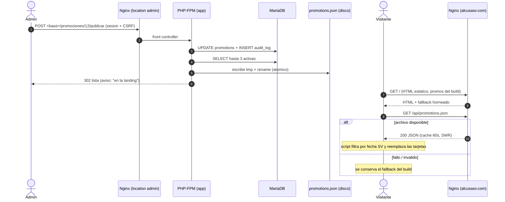
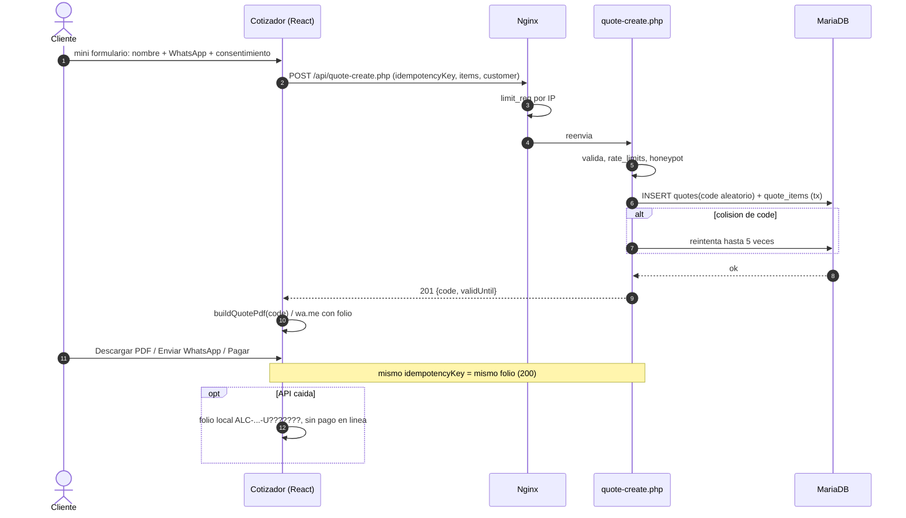
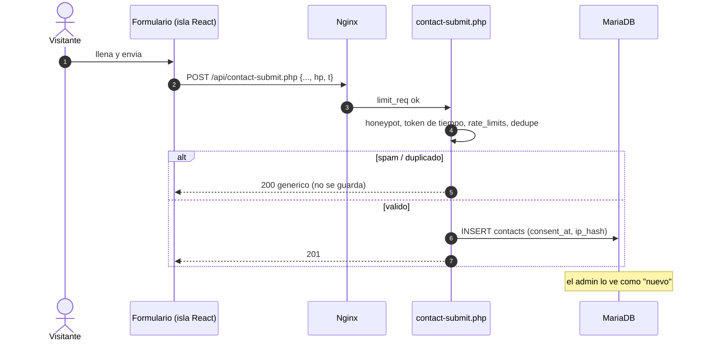
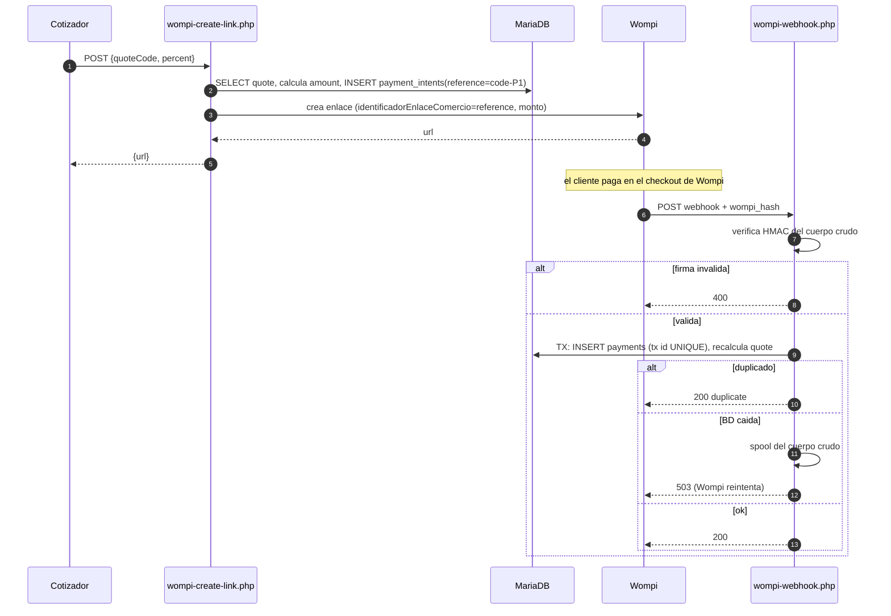

# ADR-011: Panel admin, promociones dinámicas, folio de cotización, webhook y contactos (CR-01)

Date: 2026-09-29 (enmendado 2026-09-30, ver abajo)
Status: proposed (pendiente de revisión del cliente; se vuelve accepted al aprobar CR-01)
Depende de: ADR-010 (base de datos y modelo). Toca: ADR-002, ADR-003, ADR-008 §5, ADR-009 §4, ADR-012.

## Enmienda 2026-09-30 (decisiones de Carlos)
1. **Admin: del subdominio `admin.alcusasv.com` a una ruta protegida e inadivinable del host principal** (`/xxx-ops3001` en docs; valor real solo en el VPS). Cambian §1 (tabla y configuración), §2 (cookie `__Host-` con `Path=/`, CSRF, fuerza bruta, bloque Nginx, cabeceras), §9 (superficie de red), §10 (amenazas nuevas), slice D0 (sin DNS ni certificado de admin) y la pregunta abierta 12.
2. **Nombre + WhatsApp se piden antes de generar el PDF** (mini formulario en Resumen): §5 reescrito con el contrato final `QuoteFolioRequest`, validación y normalización E.164, consentimiento, retención propuesta (12 meses sin pago) y cambios requeridos en el FE; ver también ADR-010 §3/§7 y ADR-012. Preguntas abiertas 13–15.
3. **Tope de 3 promociones activas confirmado**; publicar se bloquea por solapamiento de fechas (§4). Pregunta 16.
4. **Enmiendas pendientes de ADR-012 aplicadas**: folio `{6}`=>`{8}` (7 aleatorios + 1 de control), `quotes.code CHAR(21)`, `quote_items.config` = snapshot completo + `config_schema_version` + `promo_ref`, lista blanca PHP con `/api/quotes/{code}` (§9), referencia Wompi de 24 caracteres (§8 nota). El ejemplo de ADR-012 (`...K7QM-3X9T`) estaba mal: el dígito de control correcto es `0` (`ALC-20260930-K7QM3X90`).
5. **Consistencias**: marcador de contingencia `L` => `U` (evita ambigüedad con `l`/`1`); dinero en dólares decimales (no centavos); `supersedes` solo enlaza y no cambia el estado de la cotización anterior.

## Contexto
CR-01 pide un panel admin para: CRUD de promociones (imagen, descripción, precio, reglas aún sin definir), cotizaciones con ID
único visible para cliente y admin, ventas Wompi ligadas a su cotización, contactos del formulario, y que la landing muestre
las 3 promociones activas desde la BD. El resto del sitio sigue estático.

Estado actual: Astro estático + islas React (ADR-001) servido por Nginx; solo 3 endpoints PHP ejecutables (`wompi-create-link`,
`wompi-return`, `wompi-webhook`) con `_lib/` denegado (ADR-002 rev., runbook). Secretos y datos en `alcusa-private/` fuera de
releases. `open_basedir` y `disable_functions` restringen el pool `alcusa`. Presupuesto de JS de la landing 40 KB gzip y CLS ≤ 0.1.
Equipo: 1 dev frontend; sin DBA ni SRE dedicados. Volumen SUPUESTO en ADR-010 (5–30 cotizaciones/día).

Principio rector: **el sitio público no debe depender de la BD para mostrarse**; la BD y el admin son una capa añadida, no un
nuevo punto único de falla del landing.

## Decisión

### 1. Dónde vive y cómo se construye el admin (enmendado 2026-09-30)
**Ruta protegida e inadivinable en el host principal** (prod `https://alcusasv.com/<base>/`, dev `https://dev.alcusasv.com/<base-dev>/`), **PHP 8.3 renderizado en servidor**, plantillas PHP nativas, JS vanilla mínimo. **No** hay SPA React ni API JSON para el admin. En docs, tableros y tests la base es el marcador `/xxx-ops3001`; el valor real existe solo en la configuración del VPS (abajo) y nunca en el repo.

| Criterio | Subdominio `admin.` (decisión del 2026-09-29) | **Ruta secreta en el mismo host** (vigente desde 2026-09-30) |
|---|---|---|
| Descubribilidad | El nombre queda en los logs públicos de Certificate Transparency (crt.sh) apenas certbot emite su certificado, y es enumerable por DNS: cualquier escáner lo conoce en horas | No aparece en CT ni en DNS; solo se conoce por fuga o adivinándola. Es el motivo del cambio |
| Aislamiento de origen | Origen propio: un XSS en la landing no toca el admin | **Comparte origen con la landing**: un XSS en el público podría llamar al admin con la sesión del operador. Es la pérdida real de esta decisión (compensaciones en §10) |
| Cookie | `__Host-` acotada al admin | `__Host-` con `Path=/` (ver §2 por qué no `__Secure-`) |
| CSP / cabeceras | Vhost propio | `location ^~ <base>/` con cabeceras propias (un `add_header` en un `location` anula las del `server`; el snippet las repite) |
| Controles de Nginx | Vhost separado, cambiable sin tocar el público | Mismo vhost: un error del include afecta al público, así que `nginx -t` es obligatorio en el deploy y el bloque vive en un snippet aparte |
| Costo | 1 DNS + 1 certificado certbot por entorno | Ninguno: D0 se simplifica |
| Modo de fuga | Publicado por diseño (CT) | Secreto de configuración: puede filtrarse por capturas de pantalla, chats, historial del navegador, logs, Referer |

Elección: **ruta secreta**, por pedido de Carlos. Honestidad: el subdominio aísla mejor (origen propio); la ruta oculta mejor (CT/DNS) y cuesta menos. Se acepta porque hay 1–3 operadores, pocas acciones destructivas (sin borrado; se cancela y se publica), y un sitio público estático sin HTML de usuario. **La oscuridad es una capa extra, no un control**: argon2id, TOTP obligatorio, lockout, CSRF y auditoría (§2) siguen exactamente igual.

**La base es configuración, no código.** Valor real solo en `alcusa-private/config.php` (`ADMIN_BASE_PATH`) y en el snippet de Nginx que `05-ops` renderiza **en el VPS** desde una plantilla con `__ADMIN_BASE__`; se guarda además en el gestor de contraseñas de Carlos. Jamás en repo, tableros, tests, logs de CI ni chat; los docs usan `/xxx-ops3001`. Reglas: se **genera** con CSPRNG (≥ 12 caracteres aleatorios `[a-z0-9]`, ≈ 62 bits, por ejemplo `/<12 aleatorios>-ops3001`) y no se inventa a mano (los nombres "humanos" caen por diccionario); `Config` valida `^/[a-z0-9][a-z0-9-]{14,47}$`, rechaza una lista corta (`/admin`, `/login`, `/panel`, `/ops`, `/wp-admin`) y **aborta el arranque en producción si el valor es el marcador**; dev y prod usan valores distintos. La app nunca hardcodea rutas: enlaces, redirecciones y `form action` salen de `Url::admin()`. Rotación (fuga o baja de un operador): nuevo valor, re-render del snippet, `nginx -t && reload`, `--rotate` de usuarios si hace falta; las sesiones sobreviven porque la cookie es `Path=/`.

| Criterio | **PHP renderizado en servidor** | React SPA + API JSON |
|---|---|---|
| Piezas nuevas | 0 (mismo lenguaje que Wompi/API) | Segundo build, tokens/CSRF para la API, DTOs duplicados, más superficie |
| Validación | Un solo lugar (servidor) | Duplicada cliente/servidor |
| Riesgo XSS | Escape en plantilla (`htmlspecialchars`) + CSP sin `unsafe-inline` | Menor por defecto en React, pero mayor superficie de API |
| Interactividad requerida | Listados, filtros, formularios, subir imagen: no necesita SPA | Innecesaria |
| Mantenimiento | Un dev PHP/TS lo lee entero | Dos stacks de admin |

Elección: renderizado en servidor. Ninguna pantalla del alcance (5 listados, 1 CRUD, cuenta) justifica una SPA.
Costo: sin interactividad rica (filtros recargan página; la vista previa de la promo se resuelve con un formulario de dos pasos).
Salida: las acciones viven en clases de servicio (`app/src/Service/*`); si un día hace falta SPA, se les pone un controlador JSON encima sin reescribir la lógica.
Rechazado: WordPress/CMS/Directus (ver ADR-010 alternativas), Laravel/Symfony (framework completo para ~10 pantallas; Composer + actualizaciones de seguridad).
Dependencias PHP: ninguna obligatoria en v1 (PDO, `sodium`, GD, `password_hash` ya vienen en 8.3); si se agrega una, es por ADR o nota de revisión.

**Estructura de código** (`03-dev/`):
```
app/src/          # clases PHP (Db, Config, Auth, Service/*, Repo/*, PromotionRuleRegistry) — fuera del docroot
app/templates/    # plantillas del admin
admin/public/index.php   # único front controller ejecutable bajo la ruta admin (<base>/)
api/promotions-publish.php ... # ver §4; los .php públicos son finos y llaman a app/src
bin/              # migrate.php, create-admin.php, retention.php, publish-promotions.php (solo CLI)
db/migrations/    # ADR-010 §5
```
Regla de erosión (review gate): cero lógica de negocio en `api/*.php` ni en plantillas; todo en `app/src`.
Nginx: bajo `location ^~ <base>/` solo `admin/public/index.php` es ejecutable (SCRIPT_FILENAME fijo); en el resto del vhost público la lista blanca de `.php` crece explícitamente (§4, §7, §9) y todo lo demás sigue en 404 (checklist del runbook se actualiza).
Pool PHP-FPM: mismo pool `alcusa` en v1; pool separado `alcusa-admin` es tech-debt (trigger: segundo operador o hallazgo de seguridad). `open_basedir` se amplía a `.../alcusa-private/uploads`.

**Pantallas v1**: inicio (contadores + pagos no conciliados), promociones (lista, crear/editar, publicar/despublicar/archivar, vista previa), cotizaciones (lista con filtros por estado/fecha/búsqueda de folio, nombre o WhatsApp; detalle con ítems y pagos), ventas (pagos, marca `unmatched`/`amount_mismatch`/`test`), contactos (lista, marcar leído/atendido/spam), auditoría (solo lectura), mi cuenta (cambiar contraseña, TOTP). Solo lectura en cotizaciones/ventas/contactos, salvo el estado de contactos y el cancelar cotización.

### 2. Autenticación y sesión
- **Sin auto-registro**: no existe ruta de alta. Los usuarios se crean solo por CLI en el VPS (ver "Bootstrap").
- **Contraseñas**: `password_hash($pw, PASSWORD_ARGON2ID, ['memory_cost' => 65536, 'time_cost' => 3, 'threads' => 1])` (ajustar para ~250 ms en el VPS y documentar en el runbook); `password_needs_rehash` al iniciar sesión. Largo mínimo 14 al cambiarla; sin reglas de composición; se rechaza la contraseña igual al username o a una lista corta de comunes.
- **TOTP (RFC 6238) obligatorio para todo admin**, decisión adoptada: SHA-1, 6 dígitos, 30 s, ventana ±1, control anti-replay con `totp_last_step`. Secreto cifrado con `sodium_crypto_secretbox` (clave en `config.php` externo), 8 códigos de recuperación de un solo uso guardados hasheados. Implementación propia de ~60 líneas con vectores de prueba de la RFC (sin dependencia). El usuario necesita una app autenticadora en su celular (pregunta al cliente).
- **Bootstrap y recuperación por CLI** (`bin/create-admin.php`, no es una ruta web):
  - Primer usuario: `alcusa`. Comando en el VPS por SSH: `sudo -u alcusa php bin/create-admin.php alcusa`.
  - Aborta si `PHP_SAPI !== 'cli'` (no puede invocarse desde FPM ni por HTTP).
  - Genera la contraseña con CSPRNG (`random_int`, ≥ 20 caracteres, alfabeto sin ambiguos), la **imprime una sola vez** en el terminal del operador para llevarla al gestor de contraseñas, y **se niega a imprimirla si stdout no es un TTY** (para que no acabe en un pipe, log de CI o archivo). Guarda solo el hash argon2id. Limpia el buffer con `sodium_memzero`.
  - La contraseña nunca se acepta por argumento ni por variable de entorno, y nunca va a repo, logs, BD en claro, archivos `.env` ni chat. El script tampoco loguea la contraseña ni el hash.
  - Crea al usuario con `must_change_password=1` y sin TOTP: en el **primer login** solo se permiten dos pantallas, cambiar la contraseña y enrolar TOTP (con QR y códigos de recuperación); cualquier otra ruta redirige ahí (middleware sobre `stage`, `must_change_password`, `totp_enabled_at`).
  - Modo `--rotate` (reset): mismo script sobre un usuario existente, genera una contraseña nueva con las mismas reglas, pone `must_change_password=1`, limpia `failed_attempts`/`locked_until` e **invalida todas sus sesiones**; el TOTP se conserva salvo `--reset-totp`, que lo borra y obliga a re-enrolar. Es también el camino de recuperación (no hay "olvidé mi contraseña" por correo: no hay canal de correo confiable ni se justifica un flujo de reseteo web).
  - Cada ejecución escribe en `audit_log` (`admin.created` / `admin.password_rotated` / `admin.totp_reset`, `actor_type=cli`, usuario del SO) sin ningún dato secreto. El mismo script sirve para crear otros admins.
  - Si en el futuro Carlos/CDC necesita acceso soporte, se crea un usuario propio; no se comparten cuentas.
- **Sesiones en BD** (`admin_sessions`, ADR-010): identificador aleatorio de 256 bits, se guarda su SHA-256. Cookie **`__Host-alcusa_admin`** con `Secure; HttpOnly; SameSite=Strict; Path=/` y sin `Domain`. Rotación de id al pasar de `password_ok` a `active` (tras TOTP) y al cambiar la contraseña. Inactividad 30 min, duración absoluta 8 h. Logout = POST + borrado de la fila.
  - **Por qué `__Host-` (Path=/) y no `__Secure-` con `Path=<base>/`**: `__Host-` obliga `Path=/`, así que la cookie viaja también a la landing; `__Secure-` permitiría acotarla a la ruta admin. Se elige `__Host-` porque (1) es la única que el navegador protege contra *cookie tossing* desde subdominios hermanos (`dev.alcusasv.com`, menos endurecido): con `__Secure-` un hermano podría fijar o pisar la cookie; (2) `Path` no es frontera de seguridad en el mismo origen (cualquier script del origen puede pedir `<base>/` y el navegador adjunta la cookie), así que acotar el `Path` daría una protección casi cosmética; (3) el costo de que viaje a rutas públicas es bajo: es un id opaco de 256 bits, `HttpOnly`, `Secure`, y se neutraliza donde importa (`fastcgi_param HTTP_COOKIE ""` hacia los `.php` públicos; el log de Nginx no registra `$http_cookie`). El nombre de la cookie no revela la ruta. Si un día se pone CDN/proxy, excluir cookies del cache key.
- **CSRF**: token sincronizado por sesión en cada formulario POST, comparación en tiempo constante, más `SameSite=Strict` y verificación de `Origin`/`Sec-Fetch-Site` en todo método no seguro. Ninguna mutación por GET. Límite honesto: con la ruta en el mismo origen que la landing, `Sec-Fetch-Site: same-origin` no distingue al sitio público del admin; el control que aguanta es el token (solo en HTML con `Cache-Control: no-store`) y que el público no ejecute HTML ajeno (§10).
- **Fuerza bruta**: Nginx `limit_req` en `<base>/login` (5 req/min/IP, burst 5) y uno general de la ruta (`admin_all`, 60 req/min/IP); en la app, contador por username y por IP-hash (`rate_limits`): 5 fallos → bloqueo exponencial 1, 5, 15, 60 min (`locked_until`); mensaje único "credenciales inválidas" y verificación de hash ficticia para usuario inexistente (sin enumeración por tiempo o texto); el TOTP fallido cuenta igual. `fail2ban` lee un **log propio** (`/var/log/nginx/alcusa-admin.log`, solo lo que entra por la ruta admin) y banea IPs con `POST` a login con 401/429 repetidos: así el filtro no contiene la ruta secreta. Cada fallo y bloqueo va a `audit_log`.
- **Bloque Nginx de la ruta admin** (el mismo vhost público; plantilla con marcador, el valor real se renderiza en el VPS):
  ```nginx
  # snippets/alcusa-admin.conf  (generado; __ADMIN_BASE__ = valor real, p. ej. el equivalente de /xxx-ops3001)
  location = __ADMIN_BASE__ { return 404; }                       # sin barra final: mismo 404 que el resto
  location ^~ __ADMIN_BASE__/assets/ { alias /var/www/alcusa/current/admin/public/assets/; include snippets/alcusa-admin-headers.conf; }
  location = __ADMIN_BASE__/login { limit_req zone=admin_login burst=5 nodelay; include snippets/alcusa-admin-php.conf; }
  location ^~ __ADMIN_BASE__/ {                                    # ^~ gana a la regla global "\.php$ -> 404"
      access_log /var/log/nginx/alcusa-admin.log admin_fmt;        # sin $http_cookie; fail2ban lee este archivo
      limit_req zone=admin_all burst=20 nodelay;
      if ($admin_allowed = 0) { return 404; }                      # allowlist opcional (geo), 404 y no 403
      include snippets/alcusa-admin-php.conf;
  }
  # alcusa-admin-php.conf: include snippets/alcusa-admin-headers.conf; include fastcgi_params;
  #   fastcgi_param SCRIPT_FILENAME /var/www/alcusa/current/admin/public/index.php;   # fijo: ningun otro .php corre aqui
  #   fastcgi_intercept_errors on;  (error_page 404 => la misma pagina 404 del sitio)
  ```
  Nota: un `add_header` dentro de un `location` **anula** los del `server`, por eso `alcusa-admin-headers.conf` repite HSTS y `nosniff`. La app recibe `REQUEST_URI` completa y recorta `ADMIN_BASE_PATH` (nunca hardcodeado).
- **Cabeceras de la ruta admin** (`alcusa-admin-headers.conf`): `Content-Security-Policy: default-src 'self'; img-src 'self' data:; script-src 'self'; style-src 'self'; frame-ancestors 'none'; form-action 'self'; base-uri 'none'` (sustituye a la CSP de la landing solo aquí), `X-Robots-Tag: noindex, nofollow, noarchive`, `Referrer-Policy: no-referrer`, `Cache-Control: no-store` en respuestas autenticadas, HSTS junto con el resto (ADR-002). **Nunca se lista la ruta** en `sitemap*.xml` ni en `robots.txt` (un `Disallow: <base>/` la revelaría); un test de build falla si el sitemap o el robots contienen el marcador `xxx-ops` o cualquier `Disallow`. **404 uniforme**: toda petición sin sesión a algo distinto de `login` y sus assets, y toda ruta desconocida, devuelve el mismo 404 (cuerpo y cabeceras) que el sitio público. Opcional y apagado por defecto: allowlist de IP (`geo $admin_allowed`) si el cliente opera desde IP fija.

### 3. Subida de imágenes (promociones)
Flujo (servidor, `Service\ImageIngest`), aplicado a **todo** archivo subido; el cliente nunca decide tipo, nombre ni ruta:
1. Límite de 5 MB (`client_max_body_size` solo en la ruta de subida + `upload_max_filesize`), una imagen por petición, solo con sesión `active` + CSRF.
2. Detección real: `finfo(FILEINFO_MIME_TYPE)` **y** `getimagesizefromstring`; solo `image/jpeg`, `image/png`, `image/webp`. Extensión y `Content-Type` del cliente se ignoran. **SVG, GIF, HEIC y cualquier otro se rechazan** (SVG = XSS/SSRF).
3. Tope de dimensiones (lado ≤ 6000 px y ≤ 24 megapíxeles) **antes** de decodificar (mitiga bombas de descompresión) y `memory_limit` acotado.
4. **Recodificación obligatoria** con GD: decodificar a lienzo, descartar EXIF/ICC/metadatos y cualquier payload políglota, y guardar como **WebP** en 3 anchos (400/800/1200, sin ampliar más que la fuente), calidad ~80. Mantiene el NFR de imágenes del README (WebP; se documenta que AVIF/`<picture>` con fallback no es necesario para estos assets porque WebP es universal en los navegadores objetivo). Verificar `gd` con WebP en el VPS (paquete `php8.3-gd`).
5. Nombre de archivo generado por el servidor: `<image_key>-<ancho>.webp` con `image_key = 16 bytes aleatorios en hex`; jamás derivado del nombre original. `image_alt` obligatorio (WCAG).
6. Almacenamiento **fuera del docroot y de los releases**: `/var/www/alcusa-private/uploads/promotions/` (0750, propietario `alcusa`), incluido en respaldos (ADR-010 §6). Se sirve solo con Nginx: `location /media/ { alias /var/www/alcusa-private/uploads/promotions/; }` con `add_header X-Content-Type-Options nosniff`, `Cache-Control: public, max-age=31536000, immutable` (el nombre cambia al reemplazar la imagen) y **sin PHP** (la regla `location ~ \.php$ { return 404; }` gana en ese vhost). Respuesta con `Content-Type` fijo `image/webp`; sin autoindex.
7. Al reemplazar/archivar una promoción, las imágenes huérfanas se borran en la purga de retención (no en la petición web).
Costo: GD consume memoria en imágenes grandes (acotado por el tope de megapíxeles); salida: si se requiere AVIF, `imagick`/libavif detrás de `ImageIngest`.

### 4. Cómo llegan las promociones a la landing estática
Opciones:

| Opción | JS extra | Depende de BD/PHP al cargar | Frescura | Complejidad |
|---|---|---|---|---|
| A. Fetch en runtime a un endpoint PHP/BD | Sí | **Sí** (BD caída = bloque roto) | Inmediata | Baja |
| B. Rebuild + deploy al publicar (CI) | No | No | Minutos; el admin necesita token de GitHub/CI en el VPS o un webhook | Alta, más secretos, build de 1–3 min por cambio |
| **C. Publicar un JSON estático desde PHP + fetch de ese archivo, con fallback horneado en el HTML** | Sí (script inline ≈ 1 KB, dentro de ADR-008) | **No** (Nginx sirve un archivo) | Inmediata al guardar + cron | Baja |

**Decisión: C.**
- Al guardar/publicar/archivar una promoción, `Service\PromotionPublisher` construye `promotions.json` con las **hasta 3 activas** y lo escribe **de forma atómica** (`tmp` + `rename`) en `/var/www/alcusa-private/public/promotions.json`; Nginx lo expone en `GET /api/promotions.json` (`alias`, `application/json`). No hay PHP ni BD en la ruta de lectura.
- Selección: `status='published'` y `starts_on <= hoy_SV <= ends_on`, orden `sort_order ASC, ends_on ASC, id ASC`, `LIMIT 3` (misma regla de fechas y comparación de string que ADR-008 §5). El admin muestra cuáles están "en la landing" hoy y cuáles están programadas.
- **Tope de 3 promociones activas (confirmado 2026-09-30)**: constante `MAX_ACTIVE_PROMOTIONS = 3` (configuración, no literal). **Publicar queda bloqueado** si, para algún día de la ventana `[starts_on, ends_on]` de la promo a publicar, ya hay 3 promociones `published` cuya ventana cubre ese día (cuenta por solapamiento de fechas, no "publicadas en total": se pueden programar promos futuras que no coinciden). La misma comprobación corre al editar fechas de una promo ya publicada y al republicar; despublicar, archivar y vencer nunca se bloquean. Concurrencia: `GET_LOCK('promo_publish')` + comprobación dentro de la transacción (dos operadores no pueden colarse). Mensaje: "Ya hay 3 promociones vigentes entre {a} y {b}: {títulos}. Despublica o archiva una, o cambia las fechas." Se audita `promotion.publish_blocked`. El `LIMIT 3` del publicador queda como cinturón; el estado "en cola" desaparece. Tests de B2: cuarta bloqueada, ventanas disjuntas permitidas, carrera de dos publicaciones, edición de fechas que crea solapamiento.
- Contenido del JSON: solo campos públicos (`id`, `title`, `description`, `price_before`, `price_promo`, `image` (claves y anchos), `product_slug`, `starts_on`, `ends_on`, reglas en su forma pública informativa, `generated_at`). Nunca ids internos de auditoría ni datos del admin.
- **Vencimiento sin acción del admin**: `bin/publish-promotions.php` por cron cada 15 min regenera el archivo (solo escribe si el hash cambió) y el script inline de la landing **vuelve a filtrar por la fecha de hoy en SV** (defensa doble).
- **Caché**: Nginx `Cache-Control: public, max-age=60, stale-while-revalidate=300, stale-if-error=86400` + ETag. Imágenes `immutable` (§3). Sin CDN por ahora.
- **Fallback en capas (nunca se rompe la landing)**:
  1. Archivo estático servido por Nginx (no depende de PHP ni BD; si MariaDB cae, sigue mostrando lo último publicado).
  2. Si el `fetch` falla, expira, devuelve JSON inválido o vacío por error, el script **deja el bloque tal como lo renderizó el build**: Astro sigue renderizando `Promotions.astro` desde `src/content/promotions.ts`, que pasa a ser **semilla/fallback** (idealmente vacía o con promos de temporada aprobadas por el cliente).
  3. Sin promos válidas en ninguna capa, el bloque se oculta (como ya define ADR-008).
- **CLS ≤ 0.1**: el contenedor reserva altura (`min-height`) por breakpoint; la sustitución de contenido no cambia la altura de la rejilla de 3 tarjetas; el bloque va bajo el fold (no es el LCP). Test Lighthouse en la slice FE.
- Sin JS: se ve el fallback del build; riesgo residual heredado de ADR-008 (promo vencida tras el último deploy con JS desactivado) se mantiene y sigue en tech-debt.
- Salida: si se quisiera HTML completo sin JS, se puede añadir un `sub_filter`/SSI o un rebuild por webhook de CI sin cambiar el admin ni el JSON.



### 5. El cotizador obtiene su folio
**Cuándo (enmendado 2026-09-30)**: el nombre y el WhatsApp del cliente se capturan **antes** de generar nada, en un mini formulario al inicio del paso **Resumen** (S7): nombre, WhatsApp y una casilla de consentimiento **sin marcar** con enlace al aviso de privacidad. Al enviarlo ("Generar mi cotización", un toque del usuario) el cotizador hace `POST /api/quote-create.php`; con el folio en mano se habilitan "Descargar PDF", "Enviar por WhatsApp" y "Pagar ahora". Así el POST ya no compite con la activación de `navigator.share` (ADR-009 §2): el toque de compartir solo consume un folio ya resuelto. No hay POST al entrar al paso ni por cada cambio de precio (evita basura y spam). Si después cambian el carrito, la entrega o los datos del cliente, la UI avisa "se generará un folio nuevo" y reenvía con `idempotencyKey` nueva y `supersedesCode`. El email no se pide en v1 (campo opcional del contrato por si se añade).

**Contrato final** (JSON camelCase, `Content-Type: application/json`, ≤ 32 KB, máx. 30 ítems). Es lo que el FE codifica y B3 implementa:
```ts
// Dinero: dólares decimales con máx. 2 decimales (19.99). NO centavos enteros, en quote-create ni en quote-load.
// El servidor convierte a centavos enteros, rechaza (422) un valor con >2 decimales y compara sumas en centavos.
export type Money = number;

export interface QuoteFolioItem {
  productSlug: string;              // ^[a-z0-9-]{1,80}$
  description: string;              // 1..255, solo para mostrar
  qty: number;                      // entero 1..999
  unitPrice: Money;
  lineTotal: Money;                 // == qty * unitPrice (en centavos)
  config: Record<string, unknown>;  // snapshot completo del CartItem sin `id` (ADR-012 §2); <= 4 KB por ítem
  configSchemaVersion: number;      // entero >= 1 (hoy 1)
  promoRef: string | null;          // id de la promoción aplicada (<= 60) o null
}

export interface QuoteFolioRequest {
  idempotencyKey: string;           // UUIDv4 generado en el cliente
  supersedesCode?: string;          // folio canónico previo o cargado (ADR-012); solo enlaza
  customer: {
    name: string;                   // 2..80 (alineado al board r07.1) tras normalizar
    whatsapp: string;               // E.164 (+50370001234) ya normalizado por el FE; el servidor normaliza otra vez
    email?: string;                 // opcional, <= 160; el mini formulario v1 no lo pide
  };
  delivery: { mode: 'pickup' | 'delivery'; zone?: string; address?: string }; // FE: retiro->pickup, instalacion->delivery
  items: QuoteFolioItem[];          // 1..30
  transportFee: Money;
  total: Money;                     // sum(lineTotal) + transportFee
  consent: true;                    // casilla marcada por el usuario; nunca por defecto
  privacyNoticeVersion: string;     // p. ej. '2026-10-v1'; el servidor la valida contra las vigentes
  hp: string;                       // honeypot, siempre ''
}

export interface QuoteFolioResponse {   // 201 nuevo | 200 misma idempotencyKey (mismo folio)
  code: string;                     // ALC-AAAAMMDD-XXXXXXXX (21 chars, sin guiones extra)
  validUntil: string;               // 'YYYY-MM-DD' fecha SV
  total: Money;
}

export type QuoteFolioErrorCode =
  | 'invalid_request'       // 422 forma/tipos/sumas
  | 'invalid_customer'      // 422 nombre o WhatsApp
  | 'consent_required'      // 422
  | 'idempotency_conflict'  // 409 misma clave, carrito distinto
  | 'payload_too_large'     // 413
  | 'rate_limited'          // 429 (+ Retry-After)
  | 'server_error';         // 5xx
export interface QuoteFolioError {
  error: { code: QuoteFolioErrorCode; message: string; fields?: Record<string, 'required' | 'invalid' | 'too_short' | 'too_long'> };
} // fields: 'customer.name' | 'customer.whatsapp' | 'consent' | ...; mensaje en español (sobre ADR-003)
```
- **Nombre**: NFC, `trim`, colapsar espacios; 2–80 caracteres (board r07.1; la columna VARCHAR(120) deja holgura), al menos 2 letras Unicode (`\p{L}`), sin caracteres de control ni apariencia de URL (`http`, `www.`). Se guarda como texto y se muestra escapado; no se bloquean símbolos legítimos.
- **WhatsApp** (función pura, mismos vectores TS y PHP): quitar espacios, guiones, puntos y paréntesis; `00` inicial => `+`; 8 dígitos sin prefijo => `+503` + dígitos; `503` + 8 dígitos => `+503…`. Para `+503` el primer dígito nacional debe ser 6 o 7 (celular; constante `SV_MOBILE_PREFIXES`, porque el canal es WhatsApp). Otros países solo si el usuario escribe `+código`: `^\+[1-9]\d{7,14}$`. Se guarda el E.164. Sin libphonenumber (cero dependencias): fuera de +503 se valida la forma, no el plan de numeración. Sin verificación por SMS/WhatsApp (costo y fricción sin driver).
- **Consentimiento**: `consent:true` obligatorio; se guardan `consent_at` y `privacy_notice_version` en la cotización. Finalidad limitada: preparar la cotización, contactar al cliente sobre ella y conciliar su pago. **No hay uso comercial/remarketing**: requeriría casilla aparte y ADR. El texto del aviso lo revisa el asesor legal del cliente; este ADR no afirma cumplimiento legal.
- **PII y retención (propuesta, SUPUESTO a validar)**: nombre y WhatsApp viven en `quotes.customer_name` / `customer_whatsapp` (ADR-010). **Cotizaciones sin pago: 12 meses** desde `created_at` y luego se anonimizan (más corto que los 24 previos: desde hoy se captura el contacto de **todo** visitante que genera un PDF, compradores o no; el valor comercial decae rápido y minimizar es más barato que proteger); **con pago: 10 años** y luego anonimización (obligación contable, validar con contador). Job `bin/retention.php`. Nunca en logs ni en `audit_log.diff` (solo el nombre de los campos cambiados) ni en `GET /api/quotes/{code}`. Solo el admin los ve (escapados).
- **En el dispositivo**: lo tecleado vive en el estado React y en `sessionStorage` de la pestaña (para no perderlo al recargar); nada en `localStorage` en v1 (un "recordar mis datos" sería opt-in y futuro). Cargar una cotización por folio (ADR-012) **no trae** nombre ni WhatsApp: el formulario queda vacío o con lo que esa misma pestaña ya tenga.
- **Idempotencia**: `UNIQUE(idempotency_key)`; reintento por red o doble tap devuelve la fila existente (`200`, mismo folio); misma clave con `client_cart_hash` distinto => `409 idempotency_conflict`. Cualquier cambio de carrito, entrega o datos del cliente => clave nueva + `supersedesCode`. `supersedes_quote_id` **solo enlaza**: el servidor **no cambia el estado** de la cotización anterior (con el folio como llave de lectura, cualquiera podría invalidar la de otro, ADR-012 §2); el admin muestra "hay una versión más reciente" derivada del enlace. Esto reemplaza el "queda `superseded`" del borrador anterior.
- **Validación**: tipos, longitudes, `qty` entera positiva, suma de líneas + transporte == `total` en centavos (mismo chequeo que `wompi-create-link`), rango de total, `productSlug` con formato válido, `config` de tamaño acotado y de versión conocida. **Confianza de precio**: no existe motor de precios en el servidor (es TypeScript en el cliente), así que el servidor guarda `pricing_source='client'`: la cotización es "lo que el cliente vio", no una verificación. Riesgo: alguien puede fabricar una cotización con precio bajo. Mitigaciones: el folio no obliga a la empresa (el PDF trae fecha de validez y nota de que el precio final lo confirma un asesor); el admin ve `pricing_source`; **nunca** se acepta un monto de pago del cliente (§8: el monto sale de la cotización y un asesor puede cancelarla antes de que se pague). Tech-debt con trigger: si se cobra en línea el 100% sin revisión humana, portar el motor de precios a PHP o a un paquete compartido y recalcular en servidor.
- **Abuso**: Nginx `limit_req` 10 req/min/IP (burst 5); en la app, `rate_limits` de 20 cotizaciones/hora por IP-hash y 5/hora por WhatsApp (clave = HMAC del E.164, nunca el número); honeypot; límite de tamaño; rechazo de `Origin` distinto al del sitio (comodidad, no seguridad); sin CAPTCHA en el flujo de venta (fricción); alarma si >200 cotizaciones/día. Nota: el WhatsApp de un tercero puede teclearse (no se verifica); por eso el contacto se trata como dato no verificado y la comunicación inicial la inicia el cliente hacia ALCUSA, no al revés, hasta que exista verificación.
- **Si la API no responde** (timeout 4 s, 5xx, red): el cotizador **no bloquea la cotización**: emite folio de contingencia local (`ALC-AAAAMMDD-U???????`: marcador `U`, letra que no existe en el alfabeto y que ninguna regla de normalización corrige, así que jamás se confunde con un folio real ni con un error de tecleo `l`/`1`; ver ADR-010 §4), genera el PDF y el mensaje de WhatsApp con él, y **deshabilita el pago en línea** (pagar requiere cotización en BD) mostrando "Paga con un asesor por WhatsApp". El folio de contingencia no existe en BD ni los datos del cliente llegaron al servidor; el asesor los recibe por la conversación de WhatsApp. **Un 4xx (422/409/413/429) NO cae a contingencia**: se muestra el error de campo o de límite. Tech-debt: reintentar el POST en segundo plano con la misma `idempotencyKey` y adjuntar el folio local en `client_code` (trigger: primer incidente real).

**Cambios requeridos en el borrador FE** (`r4-pdf`, `src/lib/quote-folio/index.ts`): (1) `customer` pasa de `{name?, phone?, email?}` a `{name, whatsapp, email?}` obligatorios y se agregan `consent`/`privacyNoticeVersion`; (2) `QuoteFolioItem` gana `config`, `configSchemaVersion`, `promoRef`; (3) se agrega `supersedesCode` y el `body` deja de forzar `consent:true` (lo aporta la casilla); (4) la respuesta exige `code`, `validUntil`, `total` y valida el folio con `normalizeQuoteCode` (dígito de control) antes de aceptarlo; (5) contingencia: `L` => `U` (regex de `isContingencyFolio` y el generador); (6) `withContingency` hoy atrapa todo error: debe distinguir 4xx (se propaga con `fields`) de timeout/red/5xx (contingencia); (7) tipos de error del sobre ADR-003; (8) el mini formulario y su estado en `sessionStorage`.



### 6. Contactos y antispam
`POST /api/contact-submit.php` (nuevo `.php` público en lista blanca). El island React del formulario de contacto (ADR-001) envía JSON:
`{name, phone?, email?, message, consent:true, hp, t}`.
- Campos: nombre ≤ 120, mensaje 10–2000 caracteres, teléfono **o** email obligatorio, consentimiento explícito con aviso de privacidad (`consent_at`).
- Antispam por capas, sin terceros en v1: (1) **honeypot** `hp` oculto por CSS (debe llegar vacío); (2) **token de tiempo firmado**: el servidor emite `t = base64(ts).HMAC` en `GET /api/contact-token.php` o embebido en el HTML por la isla; se rechaza si el envío ocurre en <3 s o >2 h; (3) `rate_limits`: 5 envíos/hora por IP-hash y 3/hora por teléfono/email; (4) `dedupe_hash` (SHA-256 de teléfono/email + mensaje normalizado): mismo contenido en 10 min = `200` sin insertar; (5) heurística: rechazo silencioso si el mensaje trae >2 URLs o patrones típicos; los rechazos por antispam responden `200` genérico para no dar señal al bot y se cuentan en métrica, no se guardan.
- Trigger para CAPTCHA: >10 contactos spam/día en el admin → activar **Cloudflare Turnstile** detrás de una bandera de configuración (costo: tercero y cookies; por eso no entra de inicio).
- El mensaje se almacena tal cual como **texto** y se muestra en el admin escapado (nunca como HTML). Sin envío de correo en v1 (no hay MTA en el VPS; ver pregunta abierta sobre notificaciones): el admin muestra el contador de "nuevos". Trigger para email: el cliente no revisa el panel a diario; opción SMTP de Google Workspace con contraseña de aplicación fuera del repo.
- Fallo de BD: `503` con mensaje "escríbenos por WhatsApp" (el formulario ya tiene ese canal alterno en la landing); no se pierde silenciosamente.



### 7. Promociones y folio en el PDF (impacto en ADR-008 y ADR-009)
Ver sección "Impacto" al final.

### 8. Webhook de Wompi escribe pagos
Se mantienen tal cual de ADR-003: HMAC-SHA256 del cuerpo crudo con `wompi_hash`, `hash_equals`, cuerpo ≤ 64 KB, 400 con firma inválida sin loguear cuerpo, `wompi-return.php` solo de presentación (nunca marca pagado). Cambia el destino de la escritura:
1. **`wompi-create-link.php`** deja de aceptar un monto del cliente: recibe `quoteCode` + `percent` (p. ej. 80/100), busca la cotización en BD (`status` pagable, no vencida, no cancelada), **calcula `amount = total * percent/100` en servidor**, inserta `payment_intents` con `reference = <code>-P<n>` y llama a Wompi con ese `identificadorEnlaceComercio`. Sin cotización registrada no hay pago en línea.
2. **`wompi-webhook.php`**, tras verificar la firma, en **una transacción**: `INSERT payments` con `wompi_transaction_id` `UNIQUE` (`ON DUPLICATE`/captura de `ER_DUP_ENTRY` → responde `200 duplicate`, sin reprocesar); resuelve `payment_intents` por `reference`; compara monto con `payment_intents.amount` (tolerancia 0.01); determina `status`: `approved` (ExitosaAprobada + productivo + monto ok), `amount_mismatch`, `failed`, `test` (`EsProductiva=false`, nunca cuenta) o `unmatched` (referencia desconocida: se guarda igual con `quote_id NULL`). Actualiza `payment_intents.status` y recalcula la cotización: suma de pagos `approved` ≥ total → `paid`; > 0 → `partially_paid`. Escribe `audit_log` (`payment.received`, `actor_type=system`).
3. **Falla de BD**: se **escribe el cuerpo crudo ya verificado en un spool** (`alcusa-private/data/webhook-spool/`, 0600) y se responde `503` para que Wompi reintente; `bin/replay-webhook-spool.php` lo reprocesa (idempotente por `wompi_transaction_id`). Nunca se responde 200 sin haber persistido en BD o en el spool.
4. El archivo `data/processed/` deja de ser fuente de verdad (se conserva 30 días como red de seguridad y luego se elimina en la slice de limpieza). El mock mode de ADR-003 no cambia y escribe en una BD de desarrollo/SQLite de prueba solo en tests.
5. **Longitud de la referencia (2026-09-30)**: folio de 21 caracteres + `-P` + intento de 1 dígito = **24 caracteres** (`ALC-20260930-K7QM3X90-P1`); se limita a 9 intentos de pago por cotización para no pasar de 24. El charset es `[A-Z0-9-]`. Es aritmética mía: el máximo que admite Wompi **no está verificado** y sigue siendo gate de B3 (si el tope fuera < 24, se usa `<8 chars del sufijo>-P<n>` con tabla de resolución). Riesgo abierto a verificar (slice B3): formato/longitud permitidos de `identificadorEnlaceComercio`, y si el 80% de anticipo genera un segundo enlace sobre el mismo folio (modelado con `payment_intents`).



### 9. Superficie de red resultante
| Host | Rutas ejecutables | Notas |
|---|---|---|
| `alcusasv.com` (y `dev.`) | `/api/wompi-create-link.php`, `/api/wompi-return.php`, `/api/wompi-webhook.php`, `/api/quote-create.php`, `/api/quotes/{code}` (→ `quote-load.php` fijo, ADR-012), `/api/contact-submit.php`, `/api/contact-token.php` | lista blanca explícita; `_lib`, `_dev`, dotfiles y todo otro `.php` = 404/deny. Los `.php` públicos reciben `HTTP_COOKIE` vacío (la cookie admin, `Path=/`, no debe llegar a PHP público) |
| `alcusasv.com` | estáticos: `/api/promotions.json`, `/media/*` | sin PHP |
| `alcusasv.com` ruta `<base>/` (`/xxx-ops3001` en docs; real solo en el VPS; `dev.` con su propia base) | solo `admin/public/index.php` (SCRIPT_FILENAME fijo); `<base>/assets/*` estático | CSP estricta propia, `noindex`, `limit_req` en `<base>/login`, 404 uniforme para todo lo demás, fuera de sitemap/robots. **Sin host, DNS ni certificado de admin** |
| MariaDB | ninguna pública | socket/127.0.0.1 |

### 10. Resumen de modelo de amenazas
| Amenaza | Vector | Control |
|---|---|---|
| Fuerza bruta / relleno de credenciales al admin | `<base>/login` | argon2id, lockout exponencial, `limit_req`, fail2ban, TOTP obligatorio, mensaje único, auditoría (la ruta secreta es una capa extra, no sustituye nada de esto) |
| Robo de sesión | XSS, red, cookie | cookie `__Host-` HttpOnly/Secure/Strict, id hasheado en BD, rotación, expiración, CSP estricta en la ruta admin, TLS/HSTS |
| CSRF | formularios del admin | token sincronizado + SameSite=Strict + verificación de Origin/Sec-Fetch-Site |
| XSS almacenado | descripción de promo, mensaje de contacto, nombre del cliente | texto plano, escape en salida en toda plantilla, CSP sin `unsafe-inline`, sin HTML libre en ningún campo |
| Inyección SQL | todos los inputs | PDO preparado sin emulación, `alcusa_app` sin DDL, `audit_log` solo INSERT |
| Subida maliciosa (RCE, bomba, políglota) | imagen de promo | sniffing real, lista blanca, tope de megapíxeles, recodificación, nombre aleatorio, fuera del docroot, sin PHP en `/media` |
| Falsificación/replay de webhook | POST a `wompi-webhook.php` | HMAC del cuerpo crudo, `wompi_transaction_id` UNIQUE, monto contra `payment_intents`, `EsProductiva` |
| Pago con monto manipulado | create-link | monto calculado en servidor desde la cotización |
| Cotización con precio fabricado | `quote-create.php` (motor de precios en cliente) | `pricing_source` visible, validez y confirmación por asesor, cancelación admin, tech-debt con trigger |
| Spam / llenado de BD / DoS de aplicación | quote-create, contacto | `limit_req`, `rate_limits`, honeypot, token de tiempo, dedupe, tamaños máximos, alerta de volumen y disco, purga por retención |
| Enumeración de cotizaciones | folios | folio de 35 bits aleatorios + dígito de control, `GET /api/quotes/{code}` (ADR-012) con 404 uniforme, `limit_req` + `rate_limits`, **sin PII en la respuesta**, PK interna nunca expuesta |
| Fuga de PII | BD, respaldos, logs | BD solo local, respaldos cifrados con `age`, logs sin PII (ni nombre ni WhatsApp), IP solo como HMAC, retención y anonimización (ADR-010 §7), `consent_at` + versión del aviso por cotización |
| Compromiso de secretos | repo, config | secretos solo en `alcusa-private/config.php` (0640), nunca en repo/logs; contraseña admin nunca persistida en claro |
| Inyección CSV/fórmulas | export futuro | no hay export en v1; si se agrega, prefijar `'` a celdas que empiecen con `= + - @` |
| Clickjacking / redirecciones abiertas | admin | `frame-ancestors 'none'`, sin parámetro `next` externo |
| Cadena de suministro | dependencias | cero dependencias PHP obligatorias en v1; `composer.lock` + revisión si se añade alguna |
| Abuso interno / error humano | admin | `audit_log` de cada mutación y login, borrado lógico, respaldos |
| Descubrimiento de la ruta admin | fuga (captura, chat, historial, logs, cabecera Referer) o escaneo | ruta aleatoria ≥ 60 bits, solo en config externa/gestor de contraseñas, jamás en repo/sitemap/robots/HTML público; 404 uniforme; `Referrer-Policy: no-referrer`; `limit_req` global de la ruta; rotación documentada. **No es control de acceso**: argon2id + TOTP + lockout siguen siendo la defensa |
| XSS en el sitio público con el admin en el mismo origen | script de terceros (Maps/Wompi) o inyección en la landing | sitio público estático sin HTML de usuario; datos dinámicos (`promotions.json`) solo con `textContent`; CSP del público; cookie HttpOnly; token CSRF en cada POST; pocas acciones destructivas (sin borrado). **Riesgo residual aceptado**: un XSS en el público podría hacer `fetch` al admin y leer el token; por eso el gate de `textContent` en F1 es obligatorio |
| Cookie tossing desde subdominios hermanos (`dev.`) | `Set-Cookie: ...; Domain=alcusasv.com` | prefijo `__Host-` (el navegador rechaza cookies con `Domain`); id rotado al autenticarse |
| PII de clientes (nombre + WhatsApp) en `quotes` | BD, respaldos, admin, PDF | ver "Fuga de PII"; además: sin PII en `GET /api/quotes/{code}` (ADR-012), salida escapada, retención de 12 meses sin pago, WhatsApp en `rate_limits` solo como HMAC |

No cubierto en v1 (aceptado): roles/permisos por usuario, WAF, detección de anomalías, pentest externo. Trigger: primer pago en línea productivo de alto monto o segundo operador. `senior-qa` convierte esta tabla en pruebas (auth, CSRF, subida, webhook, rate limits).

### 11. Observabilidad
Logs estructurados JSON de la app sin PII (`event`, `code`/`reference`, `status`, `latency_ms`); métricas mínimas por camino crítico: cotizaciones creadas/hora, ratio 4xx/5xx de `quote-create`, pagos por estado, pagos `unmatched`, edad del último respaldo, edad de `promotions.json`, disco libre. Health check `/api/health.php` con ping a BD **sin exponer detalles** (solo desde localhost/monitor). Definir con `senior-infrastructure` en la slice D0.

## Alternativas consideradas
- Panel como SPA React sobre API JSON, CMS/headless, Laravel/Symfony: ver §1 y ADR-010. `/admin` en el mismo host se descartó el 2026-09-29 y se **adopta el 2026-09-30 en forma endurecida** (ruta aleatoria, no `/admin`): ver tabla de §1.
- Promociones por fetch directo a PHP/BD o por rebuild en CI: ver §4.
- Enviar el monto de pago desde el cliente: rechazado (§8).
- Login por enlace mágico / OAuth: requiere correo o proveedor externo sin driver; TOTP + contraseña local basta para 1–3 operadores.
- Folio secuencial: ver ADR-010 §4.

## Consecuencias
Bueno
- La landing sigue estática y **sobrevive a la caída de PHP/BD** (JSON estático + fallback del build).
- Un solo lenguaje de servidor (PHP), sin dependencias nuevas obligatorias, sin segundo build.
- Pagos siempre atados a una cotización y calculados en servidor; webhook idempotente y sin pérdida.
- Panel con controles de seguridad razonables para el riesgo (TOTP, sesiones en BD, auditoría) y sin flujos de recuperación web que atacar.

Malo
- Estado y PII nuevos que operar y proteger (ADR-010); más superficie PHP pública (3 endpoints nuevos).
- La cotización guarda precios del cliente (sin motor en servidor): la confianza descansa en confirmación humana.
- El admin es server-rendered: menos "app-like"; si el cliente exige UX rica habrá que invertir en una SPA sobre los servicios ya separados.
- La landing con JS desactivado o con promo vencida tras el último deploy conserva el riesgo de ADR-008.
- La contingencia offline produce folios que no están en BD.

Salida: servicios en `app/src/Service` reutilizables por una API JSON; JSON público reemplazable por SSR/rebuild; motor de BD tras `Repo/*`.

## Impacto en otros ADR (actualizaciones a aplicar)
- **ADR-008 §5**: `src/content/promotions.ts` pasa de fuente de verdad a **semilla/fallback del build**. El tipo `Promotion` se extiende (`image` con anchos, `rules` públicas informativas, `id` numérico de BD) y su test de integridad se convierte en un test del **esquema del JSON** publicado (fechas `YYYY-MM-DD`, `precio_promo < precio_antes`, `product_slug` resuelve con `findBySlug`). `isActive`/`activePromotions` se reutilizan en el script inline y tienen un espejo PHP (mismos casos de prueba). El resto del catálogo (categorías, slugs, precios) sigue **estático** y sin cambios.
- **ADR-009 §4 (folio)**: `generateQuoteNumber()` deja de ser fuente: el folio lo emite el servidor (`ALC-AAAAMMDD-XXXXXXXX`, sufijo de 8 caracteres = 7 aleatorios + 1 de control; ADR-010 §4, ADR-012 §4). El PDF y el mensaje de WhatsApp se generan **después** de recibir el folio, con la misma etiqueta "N.º de cotización" (mostrado agrupado `ALC-AAAAMMDD-XXXX-XXXX`); el nombre de archivo pasa a `^Cotizacion-ALC-\d{8}-[0-9A-HJKMNP-TV-Z]{8}\.pdf$` (el folio de contingencia usa el mismo patrón con `U` inicial en el sufijo). La regla "(b) el folio es una referencia, no un registro" se **sustituye**: ahora existe un registro en BD, aunque el precio sigue sin ser verificable por el servidor (§5). El presupuesto de 1,800 caracteres del `wa.me` sube 4 caracteres por el folio más largo (recalcular). El `sessionStorage` guarda además `idempotencyKey`, el folio recibido y los datos del mini formulario (§5). El resto de ADR-009 (pdf-lib, generación 100% en el navegador, share/descarga) **no cambia**: el PDF sigue sin subirse a ningún servidor; solo se envía al servidor el JSON de la cotización. **Nuevo**: el PDF y el mensaje pueden llevar nombre y WhatsApp del cliente, que el propio usuario tecleó (no los trae el servidor).
- **ADR-003**: ver §8; ADR-002: hosting sin cambios; se añaden el bloque Nginx de la ruta admin (sin DNS ni certificado nuevos), MariaDB, `uploads/` y lista blanca de PHP (runbook y su checklist, slice D0).
- **README de arquitectura §2/§5**: RPO/RTO y "sin BD" se actualizan (slice D1).

## Plan de construcción (slices, con dueño)
| # | Slice | Dueño | Depende de | Gate de revisión del arquitecto |
|---|---|---|---|---|
| D0 | Aprovisionar MariaDB (socket, usuarios `alcusa_app`/`alcusa_migrate`), `alcusa-private/{uploads,public,data/webhook-spool}`, **bloque Nginx `location ^~ <base>/` generado desde plantilla con `ADMIN_BASE_PATH` (mismo vhost; ya NO hay vhost, DNS ni certificado de admin)**, zonas `limit_req` (`admin_login`, `admin_all`, `quote_load`), log propio `alcusa-admin.log` + jail fail2ban cuyo filtro no contiene la ruta, `location /media` y `/api/promotions.json`, lista blanca PHP (incluye `quotes/{code}`), `HTTP_COOKIE` vacío hacia PHP público, cron de respaldo cifrado + copia externa, actualizar runbook | senior-infrastructure | SO del VPS listo | Ninguna ruta PHP extra ejecutable (bajo la base solo `admin/public/index.php`); la ruta real solo en el VPS y el gestor de contraseñas (grep del repo sin coincidencias); BD sin escucha pública; sin secretos en repo |
| D1 | Esquema `0001_init.sql`, runner `bin/migrate.php`, GRANTs, script de restore y purga (`retention.php`), datos semilla de prueba, actualizar README/tech-debt | senior-dba | D0 (BD dev) | Coincide con ADR-010; `audit_log` solo INSERT/SELECT; migración reversible por expand/contract |
| B1 | Esqueleto `app/src` (Config, Db, Http, Logger), `bin/create-admin.php` (create/`--rotate`/`--reset-totp`), login, sesiones, CSRF, TOTP, forzado de cambio de clave + enrolamiento, auditoría | senior-be | D1 | Bootstrap solo CLI y solo TTY; sin contraseña en logs/repo; cookies y CSP como §2; tests de bloqueo y CSRF |
| B2 | Promociones: CRUD + registro de reglas (`terms`), `ImageIngest`, `PromotionPublisher` (JSON atómico + cron) | senior-be | B1 | Hardening de §3 completo; el JSON público no filtra campos internos |
| B3 | Cotizaciones y ventas: `quote-create.php` (idempotencia, rate limits), `payment_intents`, cambios en `wompi-create-link.php`, webhook a BD + spool + replay | senior-be | B1 (D1) | Monto calculado en servidor; idempotencia por `wompi_transaction_id`; nunca 200 sin persistir; contrato verificado con docs.wompi.sv |
| B4 | Contactos: `contact-submit.php` + antispam | senior-be | D1 | Respuestas genéricas al bot; sin PII en logs |
| B5 | Vistas del admin (dashboard, listas y detalles de cotizaciones/ventas/contactos, auditoría) + CSS del admin | senior-be (apoyo de fe-senior-react en CSS/plantillas, sin SPA) | B2–B4 | Escape en toda salida; cero lógica en plantillas |
| F1 | Landing: bloque de promociones con fetch + fallback horneado + `min-height` (CLS), semilla `promotions.ts`, test del esquema del JSON | fe-senior-react | B2 (contrato JSON) | LCP/CLS/JS ≤ 40 KB gzip; funciona con fetch caído |
| F2 | Cotizador: mini formulario nombre + WhatsApp + consentimiento en Resumen, POST de folio al enviarlo, idempotencia en `sessionStorage`, PDF/WhatsApp con el folio del servidor, contingencia offline, deshabilitar pago sin folio | fe-senior-react | B3 | Contrato de §5 (`QuoteFolioRequest`) al pie de la letra; PII solo en memoria/`sessionStorage` de la pestaña; regex de archivo `{8}`; marcador de contingencia `U`; 4xx no cae a contingencia |
| F3 | Formulario de contacto: honeypot, token de tiempo, consentimiento y estados de error | fe-senior-react | B4 | Accesibilidad de errores (no solo color) |
| Q1 | Pruebas de seguridad y resiliencia derivadas del §10 (auth, CSRF, upload, webhook replay/forjado, rate limits, BD caída, restore) | senior-qa | B1–B5, F1–F3 | Pass/fail contra los criterios de NFR |

Orden real: D0 → D1 → B1 → (B2, B3, B4 en paralelo) → (F1, F2, F3) → B5 → Q1. B5 puede arrancar en cuanto existan las tablas de su lista.

## Preguntas abiertas para el cliente
1. **Reglas de promoción**: ejemplos reales (mínimo de piezas, solo cierta zona, producto específico, código de cupón, acumulables). ¿Deben cambiar el precio en el cotizador o solo informar?
2. Las 3 promociones de la landing: ¿criterio de orden si hay más de 3 activas (manual, la que vence antes)? ¿Qué se muestra si hay 0?
3. ¿Quién operará el panel (cuántas personas) y tienen un teléfono con app autenticadora (Google/Microsoft Authenticator)? Se propone TOTP obligatorio.
4. ¿El precio de una cotización obliga a ALCUSA? ¿Validez en días (se supuso una fecha `valid_until`)? ¿Puede el cliente pagar en línea sin revisión previa de un asesor?
5. ¿Opciones de pago (80% anticipo / 100%) y qué pasa con pagos parciales (saldo)?
6. ¿Notificación cuando llega un contacto o pago (correo de Google Workspace, WhatsApp) o basta con revisar el panel?
7. ¿El cliente necesita consultar el estado de su cotización/pago desde el sitio? (requiere ADR nuevo, ver ADR-010 §4).
8. Retención: 12 meses de contactos, 12 de cotizaciones sin pago (bajó de 24 el 2026-09-30, ver §5), 10 años de ventas (supuestos). Validar con contador y asesor legal, y aprobar el texto del aviso de privacidad y consentimiento.
9. Respaldo externo: ¿destino y presupuesto (almacenamiento de objetos)? ¿Quién guarda la clave privada de descifrado?
10. ¿Hay facturación/DTE (Hacienda) que deba enlazarse con las ventas? (fuera de alcance de CR-01, afecta el modelo futuro).
11. Derechos de imagen y guía de fotos (tamaño, formato) para el cargador de promociones.
12. **Ruta del admin (reemplaza la pregunta del subdominio)**: ¿aceptan que el panel viva en una ruta secreta del sitio principal (`/xxx-ops3001` es solo el marcador; el valor real lo genera CDC en el VPS y se entrega por gestor de contraseñas a quien opere el panel)? ¿Quién custodia ese valor y lo cambia si una persona deja de operar? ¿Hay IP fija para la allowlist opcional (si no, queda apagada)?
13. **Consentimiento y aviso de privacidad del cotizador**: ¿aprueban el texto de la casilla ("Acepto el aviso de privacidad de ALCUSA; usarán mi nombre y WhatsApp para preparar mi cotización y contactarme sobre ella") y el aviso completo (revisión de su asesor legal)? ¿Habrá uso comercial/remarketing de los números? Si sí, requiere una casilla **aparte** y un ADR; v1 NO lo contempla.
14. **Retención de nombre + WhatsApp** de cotizaciones sin pago: se propone 12 meses (§5 y ADR-010 §7); ¿prefieren 24? Cotizaciones pagadas: 10 años (validar con contador).
15. **WhatsApp de clientes en el exterior**: el cotizador acepta +503 por defecto (celulares que empiezan en 6 o 7) y cualquier otro país si el cliente escribe `+código`. ¿Correcto, o solo El Salvador?
16. **Promociones sobre el tope**: con el límite de 3, ¿basta con que el operador despublique una a mano (implementado) o prefieren reemplazo automático de la que vence antes?
